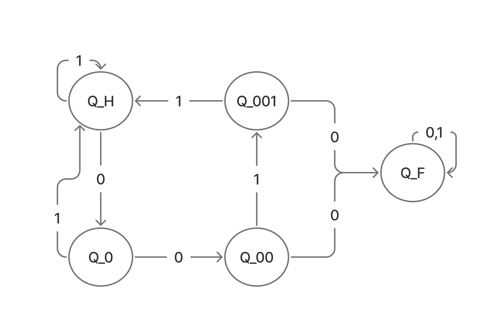
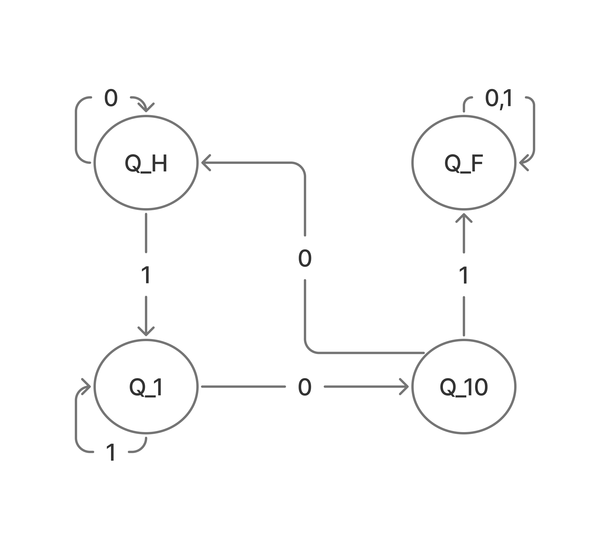

## Построение регулярных выражений и соответсвующих им детерменированных автоматов

### Разрешенные операции и синтаксис

- **Конкатенация** строк $S_{1}$ и $S_{2}$ - $S_{1}S_{2}$
- **Дизъюнкция** (ИЛИ) строк $S_{1}$ и $S_{2}$ = $S_{1} | S_{2}$
- **Замыкание** (повторение) строки $S$ - $S^{*}$ (может повторятся 0 раз)
- **Как минимум одно** повторение строки $S$ - $S^{+} = SS^{*}$ 
- $\varepsilon$ - пустая строка

### Условие:

Постройте регулярные выражения и соответствующие им детерменированные автоматы, принимающие бинарные строки в алфавите $\Sigma = \{0, 1\}$, в которых
1. За каждой парой символов $00$ (если таковая имеется) следут пара символов $11$
2. Не содержится $101$ в качеств подстроки

#### 1.

$R_{1} = (0011 | 1 | 01)^{*}(0 | \varepsilon)$

#### 2.

$R_{2} = (0 | 1^{+}00)^{*}(1^{+} | 1^{+}0 | \varepsilon)$

