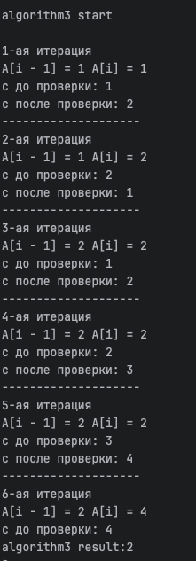

## A4. Разные алгоритмы решения одной* задачи

## Демченко Георгий Павлович , БПИ-235

### Algorithm1.cpp
```cpp
int32_t algorithm1(std::vector<int32_t> &A, size_t n) {
    int32_t c = 0;
    int32_t ind = -1;

    for (int32_t i = 0; i < n; ++i) {
        int32_t c1 = 0;
        for (int32_t j = 0; j < n; ++j) {
            if (A[i] == A[j]) {
                c1 = c1 + 1;
            }
        }
        
        if (c1 > c) {
            c = c1;
            ind = i;
        }
    }
    
    if (c > n/2) {
        return A[ind];
    }    
}
```

### Algorithm2.cpp
```cpp
int32_t algorithm2(std::vector<int32_t> &A, size_t n) {
    int32_t c = 1;
    int32_t ind = 0;
    
    for (int32_t i = 1; i < n; ++i) {
        if (A[ind] == A[i]) {
            c = c + 1;
        } else {
            c = c - 1;
        }
        
        if (c == 0) {
            ind = i;
            c = 1;
        }
    }
    
    return A[ind];
}
```

### Algorithm3.cpp
```cpp
int32_t algorithm3(std::vector<int32_t> &A, size_t n) {
    if (n == 1) {
        return A[0];
    }

    int32_t c = 1;
    std::sort(A.begin(), A.end());

    for (int32_t i = 1; i < n; ++i) {
        if (A[i - 1] == A[i]) {
            c = c + 1;
        } else {
            if (c > n/2) {
                return A[i - 1];
            }
            c = 1;
        }
    }
}
```

### 1.

**Я не согласен с данным утверждением.**

**Результат работ всех 3-х алгоритмов могут отличаться в зависимости от входных данных.**

**Алгоритм 1:**
- Находит число, которое встречается в массиве **A** наибольшее количество раз и возвращают его, если количество его вхождений $c \geq \frac{n}{2} + 1$

- В случае когда несколько различных чисел имеют одинаковое количество вхождений в массив, алгоритмы не возвращают ничего (тк $c \leq \frac{n}{2}$ в таком случае)

**Алгоритм 3:**

- Находит число, которое встречается в массиве **A** наибольшее количество раз и возвращают его, если количество его вхождений $c \geq \frac{n}{2} + 1$

- Если искомое число является наибольшим в массиве, то вывода не произойдет так как не встретится любого другого числа после него и не произойдет ветвление в **else** где располагается **return**

**Алгоритм 2:**

- **Бесполезен, ничего не решает в общем случае**

- **Если повезет с входными данными**:

    - Находит число, которое встречается в массиве **A** наибольшее количество раз и возвращает его

    - В случае когда несколько различных чисел имеют одинаковое количество вхождений в массив, алгоритм вернет то число, что было расположено ближе к концу массива наибольшее количество раз

**Пример бесполезности 2-го алгоритма**:

$A = [8, 8, 8, 2, 2, 2, 5, 5]$

**Трассировка:**


**Результаты работ совпадают:**

$A = [1, 1, 2, 2, 2, 2, 4]$

**Трассировка:**

|  **Algorithm1** |  **Algorithm2** |  **Algorithm3** |
| ---------  | ---------   | ---------   |
|   |   |   |

**Результаты работ отличаются:**

$A = [1, 1, 2, 2, 3, 3, 3]$

**Трассировка:**

|  **Algorithm1** |  **Algorithm2** |  **Algorithm3** |
| ---------  | ---------   | ---------   |
|   |   |   |

### 2.

**algorithm1 :**

**Вне зависимости от входных данных произойдет $n$ итераций цикла по $i$, в каждой их которых произойдет ещё $n$ итераций цикла по $j$**

$\Rightarrow T(n) = O(n^2) \space, f(n) = n^2$

**algorithm2 :**

**Вне зависимости от входных данных произойдет $n-1$ итерация цикла по $i$**

$\Rightarrow T(n) = O(n) \space, f(n) = n$

**algorithm3 :**

**В случае когда наименьший элемент в массиве A и есть наиболее-повторяющийся и входит в массив более чем $\frac{n}{2}$ то произойдет $(\frac{n}{2})$ итераций цикла по $i$**

**В остальных случая произойдет $(n - 1)$ итераций цикла по $i$**

**Верхняя оценка сложности алгоритма определяется сложностью применяемой сортировки, будем считать что в худшем случае она выполняется за $O(n \cdot log_2(n))$ - merge sort**

$\Rightarrow T(n) = O(n \cdot log_2(n)) \space, f(n) = n \cdot log_2(n)$

### 3.

**Изменим алгоритмы 2 и 3 так, чтобы они работали аналогично алгоритму 1:**

### Algorithm2New.cpp

```cpp
int32_t algorithm2New(std::vector<int32_t> &A, size_t n) {
    int32_t c = 1;
    int32_t ind = 0;
    std::unordered_map<int32_t, int32_t> countMap;
    int32_t ans = 0;
    int32_t max_cnt = 0;

    for (int32_t i = 1; i < n; ++i) {
        countMap[A[i]]++;
        if (A[ind] == A[i]) {
            c = c + 1;
        } else {
            c = c - 1;
        }

        if (c == 0) {
            ind = i;
            c = 1;
        }
        if (countMap[A[i]] > max_cnt) {
            max_cnt = countMap[A[i]];
            ans = A[i];
        }
    }

    if (countMap[ans] > n/2) {
        return ans;
    };
}
```

### Algorithm3New.cpp

```cpp
int32_t algorithm3New(std::vector<int32_t> &A, size_t n) {
    if (n == 1) {
        return A[0];
    }

    int32_t c = 1;
    std::sort(A.begin(), A.end());

    for (int32_t i = 1; i < n; ++i) {
        if (A[i - 1] == A[i]) {
            c = c + 1;
            if (c > n/2) {
                return A[i - 1];
            }
        } else {
            c = 1;
        }
    }
}
```

### 4.

**algorithm2New :**

**Вне зависимости от входных данных произойдет $n-1$ итерация цикла по $i$**

$\Rightarrow T(n) = O(n) \space, f(n) = n$

**algorithm3New :**

**Абсолютно аналогично изначальному алгоримту, поменяли расположение if (с > n/2) внутри ветвления.**

**Аналогично считаем, что применяется merge sort**

$\Rightarrow T(n) = O(n \cdot log_2(n)) \space, f(n) = n \cdot log_2(n)$