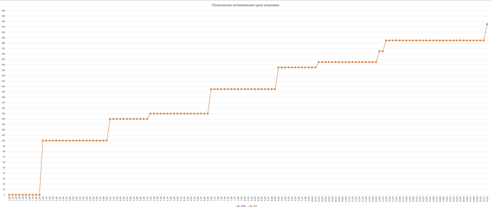
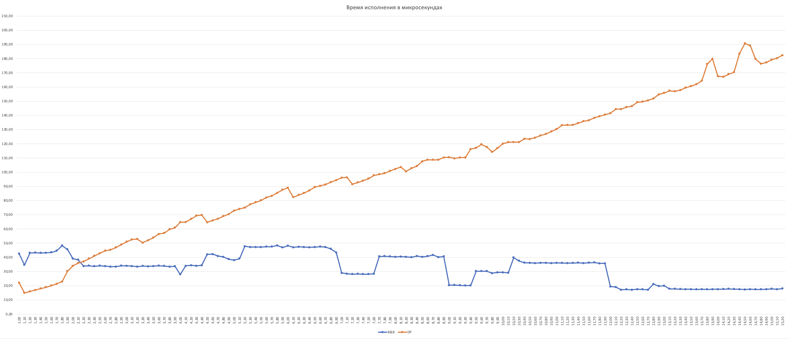

## Сравнение алгоритмов поиска оптимальной по суммарной цене упаковки рюкзака с ограничением по весу и вещественными весами предметов.

### 1. Branch and Bound method

- [BBKnapsack.h](https://github.com/AvtorPaka/Alg-DS/tree/master/src/SET_10/BranchAndBound/BBKnapsack.h)
- [BBKnapsack.cpp](https://github.com/AvtorPaka/Alg-DS/tree/master/src/SET_10/BranchAndBound/BBKnapsack.cpp)
- [Результаты тестов](https://github.com/AvtorPaka/Alg-DS/tree/master/src/SET_10/BranchAndBound/test_results/bb_knapsack.txt)

### 2. Классический подход - DP с округлением вещественных весов предметов до целочисленных

- [AlgorithmTasks.h - FindMaxKnapsackCostWithWeight](https://github.com/AvtorPaka/Alg-DS/tree/master/src/SET_10/AlgorithmTasks.h)
- [AlgorithmTasks.cpp - FindMaxKnapsackCostWithWeight](https://github.com/AvtorPaka/Alg-DS/tree/master/src/SET_10/AlgorithmTasks.cpp)
- [Результаты тестов](https://github.com/AvtorPaka/Alg-DS/tree/master/src/SET_10/BranchAndBound/test_results/dp_knapsack.txt)

### 3. Сравнение результатов и времени исполнения

**Общие параметры тестирования:**

- Количество тестов для усреднения (коэфицент усреднения): 10
- Способ усреднения: среднее арифметическое
- Время работы алгоритмов посчитано в **микросекундах**

*Набор предметов:*

| **Вес**  | **Цена**  |
| ---- | ---- |
| 2.00 | 40 |
| 3.14 | 50 |
| 1.98 | 100 |
| 5.00 | 95 |
| 3.00 | 30 |

**В результатах каждого теста написаны параметры тестирования**

#### 3.1 Результаты

*Результаты совпадают, графики накладываются друг на друга*

#### 3.2 Время исполнения

