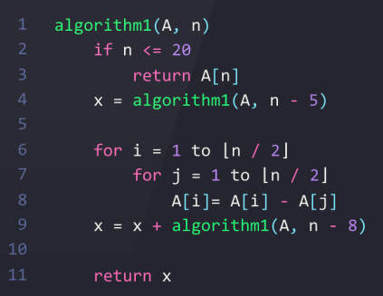
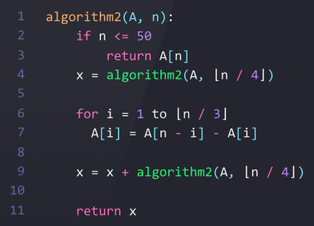

## A1. Временная сложность рекурсии

**Демченко Георгий Павлович , БПИ-235**

[Условие](https://github.com/AvtorPaka/Alg-DS/blob/master/src/SET_2/AnalysisTasks/specs/spec_1.pdf)

| algorithm1  | algorithm2  |
| -------- | -------- |
|   |   |

### 1. Временная сложность алгоритмов

Под "to m" будем воспринимать $\leq m$

"Предполагается, что все арифметические операции выполняются за постоянное время" - будем считать, что все арифм. операции выполняются за $c_{1}$

Все сравнения выполняются за $c_{2}$

Все инициализации/присвоения/return выполняются за $c_{3}$

#### algorithm1 

| **Номер строки**  | **Количество итераций** | **Затраты** |
| ----- | ------------    | --------  |
| 2-3 | 1 | $c_{2}$ (**return** невозможно отследить, опустим) |
| 4 |  1 |  $T(n - 5) + c_{3} + с_{1}$ - присвоение и вычитание|
| 6  | 1 | $c_{3}$ - инициализация |
| 6 |  $\lfloor \frac{n}{2} \rfloor + 1$ | $c_{2}$ - сравнение |
| 6 |  $\lfloor \frac{n}{2} \rfloor$ | $c_{1}$ - инкремент |
| 7 |  $\lfloor \frac{n}{2} \rfloor$ | $c_{3}$ - инициализация |
| 7  |  $\lfloor \frac{n}{2} \rfloor^2 + \lfloor \frac{n}{2} \rfloor$ |  $c_{2}$ - сравнение |
| 7 |  $\lfloor \frac{n}{2} \rfloor^2$ | $c_{1}$ - инкремент |
| 8 | $\lfloor \frac{n}{2} \rfloor^2$ | $c_{3} + с_{1}$ - присвоение и вычитание |
| 9  |  1 | $T(n-8) + c_{3} + 2c_{1}$ - присвоение, сумма и вычитание|
|  11 |  1 |  $c_{3}$ |

$\Rightarrow T(n) = T(n-5) + T(n-8) + \lfloor \frac{n}{2} \rfloor \cdot (c_{2} + c_{1} + c_{3} + c_{2}) + \lfloor \frac{n}{2} \rfloor^2 \cdot (c_{2} + c_{1} + c_{3} + c_{1}) + (c_{2} + c_{2} + c_{3} + c_{3} + c_{1} + 2c_{1} + c_{3}) =$

$= T(n-5) + T(n-8) + \lfloor \frac{n}{2} \rfloor \cdot (2c_{2} + c_{1} + c_{3}) + \lfloor \frac{n}{2} \rfloor^2 \cdot (c_{2} + 2c_{1} + c_{3}) + (2c_{2} + 3c_{3} + 3c_{1})$

**Проведем замены констант, для красвого вида**

- $2c_{2} + c_{1} + c_{3} = c_{4}$

- $c_{2} + 2c_{1} + c_{3} = c_{5}$

- $2c_{2} + 3c_{3} + 3c_{1} = c_{6}$

$\Rightarrow T(n) = T(n-5) + T(n-8) + \lfloor \frac{n}{2} \rfloor^2 \cdot c_{5} + \lfloor \frac{n}{2} \rfloor \cdot c_{4} + c_{6}$

#### algorithm2

| **Номер строки**  | **Количество итераций** | **Затраты** |
| ----- | ------------    | --------  |
| 2-3 | 1 | $c_{2}$ (**return** невозможно отследить, опустим) |
| 4  | 1  | $T(\lfloor \frac{n}{4} \rfloor) + c_{3} + c_{1}$ - присвоение и деление  |
| 6  | 1  | $c_{3}$|
| 6  | $\lfloor \frac{n}{3} \rfloor + 1$ | $c_{2}$ - сравнение |
| 6  | $\lfloor \frac{n}{3} \rfloor$ | $c_{1}$ - инкремент |
| 7  | $\lfloor \frac{n}{3} \rfloor$  | $c_{3} + c_{1}$ - присвоение и вычитание |
| 9  | 1  | $T(\lfloor \frac{n}{4} \rfloor) + c_{3} + 2c_{1}$ - присвоение, сумма и  деление  |
|  11 |  1 |  $c_{3}$ |

$\Rightarrow T(n) = 2 \cdot T(\lfloor \frac{n}{4} \rfloor) + \lfloor \frac{n}{3} \rfloor \cdot (2c_{1} + c_{2} + c_{3}) + (2c_{2} + 3c_{1} + 4c_{3})$

**Проведем замены констант, для красвого вида**

- $2c_{1} + c_{2} + c_{3} = c_{4}$

- $2c_{2} + 3c_{1} + 4c_{3} = c_{5}$

$\Rightarrow T(n) = 2 \cdot T(\lfloor \frac{n}{4} \rfloor) + \lfloor \frac{n}{3} \rfloor \cdot c_{4} + c_{5}$

### 2. $T(n) = \Theta(f(n))$

#### algorithm2

 $T(n) = 2 \cdot T(\lfloor \frac{n}{4} \rfloor) + \lfloor \frac{n}{3} \rfloor \cdot c_{4} + c_{5}$

 **Предположение**

Пусть $f(n) = n, т.е \space T(n) = \Theta(n)$

$\Rightarrow \exists \space d_{1} , d_{2} \in \mathbb{R}^+ : \forall \mathbb{N} > N_{0} : d_{2} \cdot n \leq T(n) \leq d_{1} \cdot n$

* Пусть $N_{0} = 1$

#### Ограничение сверху

* Для точности ограничения сверху раскроем  $\lfloor \frac{n}{4} \rfloor$ и $\lfloor \frac{n}{3} \rfloor$ как $\frac{n}{4} $ и $\frac{n}{3}$, так как $\lfloor \frac{n}{k} \rfloor \leq \frac{n}{k} \space \forall k \in \mathbb{N}$

$T(n) \leq d_{1} \cdot n$

$\Rightarrow T(n) = 2 \cdot T(\lfloor \frac{n}{4} \rfloor) + \lfloor \frac{n}{3} \rfloor \cdot c_{4} + c_{5} \leq 2 \cdot T( \frac{n}{4}) + \frac{n}{3}  \cdot c_{4} + c_{5} \leq 2 \cdot d_{1} \cdot \frac{n}{4} + \frac{n}{3}  \cdot c_{4} + c_{5} \leq d_{1} \cdot n$

$  d_{1} \cdot \frac{n}{2} + \frac{n}{3}  \cdot c_{4} + c_{5} \leq d_{1} \cdot n$

$  \frac{n}{3}  \cdot c_{4} + c_{5} \leq d_{1} \cdot \frac{n}{2}$

$ d_{1} \geq \frac{2 \cdot c_{4}}{3} + \frac{2 \cdot c_{5}}{n} \space \forall \mathbb{N} \ge 2$

$\Rightarrow d_{1} \geq \frac{2 \cdot c_{4}}{3} + c_{5} \in \mathbb{R}^+$ - Предположение о верхней границе верно

#### Ограничение снизу

* Для точности ограничения снизу раскроем $\lfloor \frac{n}{4} \rfloor$ и $\lfloor \frac{n}{3} \rfloor$ как $(\frac{n}{4} - 1) $ и $(\frac{n}{3} - 1)$, так как $\frac{n}{k} - 1 < \lfloor \frac{n}{k} \rfloor  \space \forall k \in \mathbb{N}$

$d_{2} \cdot n \leq  T(n) $

$\Rightarrow d_{2} \cdot n \leq 2 \cdot (\frac{n}{4} - 1) \cdot d_{2} + (\frac{n}{3} - 1)  \cdot c_{4} + c_{5} \leq 2 \cdot T( \frac{n}{4} - 1) + (\frac{n}{3} - 1)  \cdot c_{4} + c_{5} \leq 2 \cdot T(\lfloor \frac{n}{4} \rfloor) + \lfloor \frac{n}{3} \rfloor \cdot c_{4} + c_{5} =  T(n)$

$d_{2} \cdot n \leq \frac{n}{2} \cdot d_{2} - 2 \cdot d_{2} + \frac{n}{3} \cdot c_{4} + c_{5} -  c_{4}$

$d_{2} \cdot (\frac{n + 4}{2}) \leq \frac{n}{3} \cdot c_{4} + c_{5} -  c_{4}$

**Вспомним про произведенные замены**

$c_{5} - c_{4} = 2c_{2} + 3c_{1} + 4c_{3} - (2c_{1} + c_{2} + c_{3}) = c_{1} + c_{2} + 3c_{3} = c_{6} > 0$

$\Rightarrow d_{2} \cdot (\frac{n + 4}{2}) \leq \frac{n}{3} \cdot c_{4} + c_{6}$

(т.к $N_{0} = 1$) $\forall \mathbb{N} \ge 2: $

$\Rightarrow d_{2} \cdot (\frac{n + 4}{2}) \leq d_{2} \cdot \frac{5n}{2}\leq \frac{n}{3} \cdot c_{4} + c_{6}$

$d_{2} \leq \frac{2}{15} \cdot c_{4} + \frac{2 \cdot c_{6}}{5n}$

$\Rightarrow d_{2} \leq \frac{2}{15} \cdot c_{4} \in \mathbb{R}^+$ - Предположение о нижней границе верно

**Значит изначальное предположение верно и $T(n) = \Theta(n)$**

#### algorithm1

$ T(n) = T(n-5) + T(n-8) + \lfloor \frac{n}{2} \rfloor^2 \cdot c_{5} + \lfloor \frac{n}{2} \rfloor \cdot c_{4} + c_{6}$

**Невозможно сформировать ассимтотически-точную границу T(n) из-за неявной глубины рекурсии. Будем отдельно рассматривать верхнюю и нижнюю границы**

#### Ограничение сверху

 - Для точности ограничения сверху раскроем $\lfloor \frac{n}{2} \rfloor$ как $\frac{n}{2}$ так как $ \lfloor \frac{n}{k} \rfloor \leq \frac{n}{k} \space \forall k \in \mathbb{N}$

 - Также заменим $T(n-5) + T(n - 8)$ на $2 \cdot T(n-5)$, т.к тогда мы имеем наибольшую глубину рекурсии и наибольшие затраты на подзадачи на уровне рекурсии

 $\Rightarrow T(n) \leq 2 \cdot T(n-5) + (\frac{n}{2})^2 \cdot c_{5} + \frac{n}{2} \cdot c_{4} + c_{6} = 2 \cdot T(n-5) + O(n^2)$

 $\Rightarrow T(n) \leq 2 \cdot T(n-5) + r_{1} \cdot n^2 \quad \forall \mathbb{N} > N_{1} $ - некоторый $N_{1}$ для $O(n^2)$

 Докажем, что $T(n) = O(2^{\frac{n}{5}} \cdot n^2)$

 $\Rightarrow \exists \space d_{1} \in \mathbb{R}^+ : \forall \mathbb{N} > N_{0} :  T(n) \leq d_{1} \cdot 2^{\frac{n}{5}} \cdot n^2$

Пусть $N_{0} = max(N_{1}; 9)$

$T(n) \leq 2 \cdot T(n-5) + r_{1} \cdot n^2 \leq d_{1} \cdot 2^{\frac{n}{5}} \cdot n^2$

$\Rightarrow 2 \cdot T(n-5) + r_{1} \cdot n^2 \leq 2 \cdot d_{1} \cdot 2^{\frac{n-5}{5}} \cdot (n-5)^2 + r_{1} \cdot n^2 \leq d_{1} \cdot 2^{\frac{n}{5}} \cdot n^2$

$d_{1} \cdot (2^{\frac{n}{5}} \cdot n^2 - 2 \cdot 2^{\frac{n-5}{5}} \cdot (n-5)^2) \geq r_{1} \cdot n^2$

$d_{1} \cdot (2^{\frac{n}{5}} \cdot n^2 - 2 \cdot \frac{2^{\frac{n}{5}}}{2} \cdot (n^2-10n + 25)) \geq r_{1} \cdot n^2$

$d_{1} \cdot (2^{\frac{n}{5}} \cdot (n^2 - n^2 + 10n - 25)) \geq r_{1} \cdot n^2$

$d_{1} \cdot 2^{\frac{n}{5}} \cdot ( 10n - 25) \geq r_{1} \cdot n^2$

$\forall \mathbb{N} > N_{0}: (10n - 25) > n$

$\Rightarrow d_{1} \cdot 2^{\frac{n}{5}} \cdot ( 10n - 25) \geq d_{1} \cdot 2^{\frac{n}{5}} \cdot n \geq r_{1} \cdot n^2$

$d_{1} \geq \frac{r_{1} \cdot n}{2^{\frac{n}{5}}}$

$\Rightarrow d_{1} \geq \frac{5 \cdot r_{1}}{2} \space \in \mathbb{R}^{+}$

$\Rightarrow T(n) = O(2^{\frac{n}{5}} \cdot n^2)$ - **верхняя граница**

#### Ограничение снизу

- Для точности ограничения сверху раскроем $\lfloor \frac{n}{2} \rfloor$ как $(\frac{n}{2} - 1)$ так как $ \frac{n}{k} - 1 \leq  \lfloor \frac{n}{k} \rfloor  \space \forall k \in \mathbb{N}$

 - Также заменим $T(n-5) + T(n - 8)$ на $2 \cdot T(n-8)$, т.к тогда мы имеем наименьшую глубину рекурсии и наименьшие затраты на подзадачи на уровне рекурсии

 $\Rightarrow 2 \cdot T(n-8) + (\frac{n}{2} - 1)^{2} \cdot c_{5} + (\frac{n}{2} - 1) \cdot c_{4} + c_{6} \leq T(n) = T(n-5) + T(n-8) + \lfloor \frac{n}{2} \rfloor^2 \cdot c_{5} + \lfloor \frac{n}{2} \rfloor \cdot c_{4} + c_{6}$

 $ 2 \cdot T(n-8) + (\frac{n}{2} - 1)^{2} \cdot c_{5} + (\frac{n}{2} - 1) \cdot c_{4} + c_{6} = 2 \cdot T(n-8) + (\frac{n^2}{4} -n + 1) \cdot c_{5} + (\frac{n}{2} - 1) \cdot c_{4} + c_{6} = $

 $= 2 \cdot T(n-8) + n^2 \cdot \frac{c_{5}}{4} + n \cdot (\frac{c_{4}}{2} - c_{5}) + (c_{5} - c_{4} + c_{6})$

 **Произведем очередные замены для красоты:**

 - $\frac{c_{5}}{4} = c_{7}$

 - $(\frac{c_{4}}{2} - c_{5}) = c_{8}$

 - $(c_{5} - c_{4} + c_{6}) = c_{9}$

 $\Rightarrow 2 \cdot T(n-8) + n^2 \cdot c_{7} + n \cdot c_{8} + c_{9} \leq T(n)$

 **Очевидно, что $n^2 \cdot c_{7} + n \cdot c_{8} + c_{9} = \Omega(n^2)$, можно подробно расписать, но думаю факт достаточно очевидный, получится $d_{2} \leq c_{7} \in \mathbb{R^+} \space \forall \mathbb{N} > N_{1}$**

 $\forall \mathbb{N} > N_{1}$

 $\Rightarrow 2 \cdot T(n-8) + d_{2} \cdot n^2 \leq 2 \cdot T(n-8) + n^2 \cdot c_{7} + n \cdot c_{8} + c_{9} \leq T(n)$

  - **Можно расписать до дереву рекурсии и получить $\sum_{i = 0}^{[\frac{n}{8}] - 2}(2^{i} \cdot d_{2}(n - 8i)^2)$, что достаточно тяжело оценить снизу из-за слагаемых в сумме (приедтся сильно ограничивать слагаемые, вплоть до константы, что ударить по оценке), либо полноценно раскрывать и считать 3 отдельные суммы.**

  - **Иначе можно сделать менее точное предположение $T(n) = \Omega(n^2)$ и доказать его**

 $\Rightarrow \exists \space d_{1} \in \mathbb{R}^+ : \forall \mathbb{N} > N_{0} : d_{1} \cdot n^2 \leq T(n)$

 Пусть $N_{0} = max(N_{1}, 20)$

 $\Rightarrow d_{1} \cdot n^2 \leq 2 \cdot T(n-8) + d_{2} \cdot n^2 \leq T(n)$

 $d_{1} \cdot n^2 \leq  2 \cdot d_{1} \cdot (n - 8)^2 + d_{2} \cdot n^2 \leq 2 \cdot T(n-8) + d_{2} \cdot n^2$

 $d_{1} \cdot (n^2 - 2 (n^2 - 16n + 64)) \leq d_{2} \cdot n^2$

 $d_{1} \cdot (32n - n^2 + 128) \leq d_2 \cdot n^2$

 $d_{1} \cdot (32n - n^2 + 128) \leq d_{1} \cdot n^2  \leq d_2 \cdot n^2$

 $d_{1} \leq d_{2} \in \mathbb{R}^{+}$

 $\Rightarrow T(n) = \Omega(n^2)$ - **нижняя грацница**