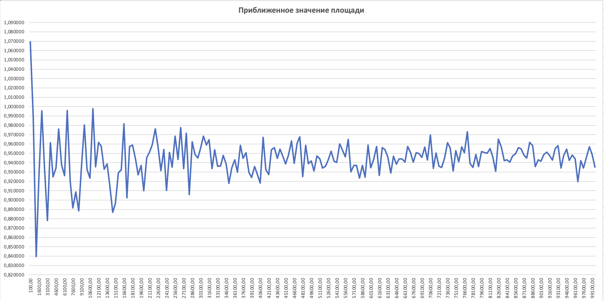
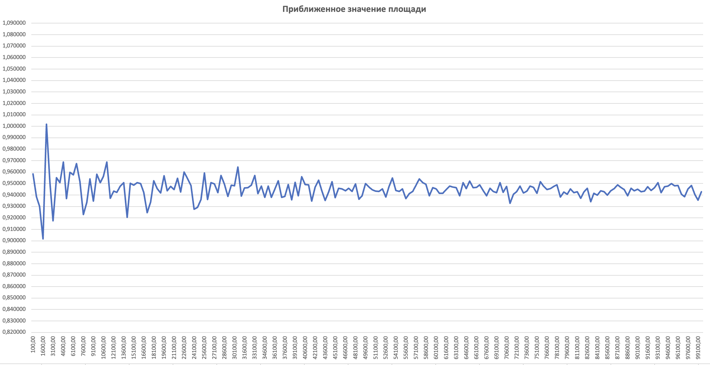
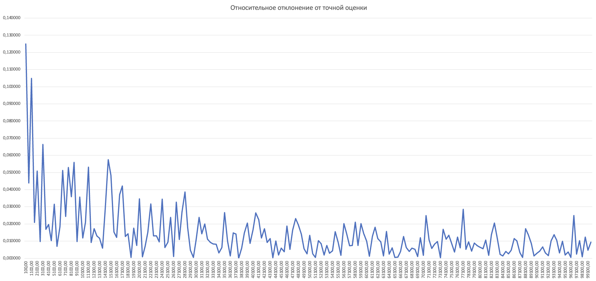
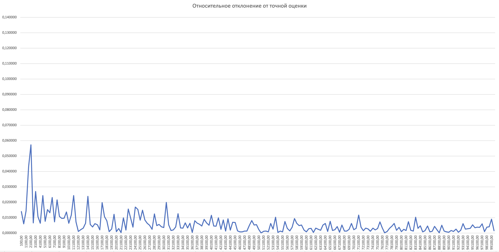

## A1. Задача трёх кругов

## Демченко Георгий Павлович , БПИ-235

## 1. Реализация алгоритма Монте-Карло

**Id посылки на CodeForces : 292375584**

**GitHub : [MonteCarloArea.cpp](https://github.com/AvtorPaka/Alg-DS/tree/master/src/SET_3/AnalysisTasks/A1/MonteCarloArea.cpp)**

## 2. Эксперементальные замеры точности

**Исходные данные эксперементальных замеров : [testResultData](https://github.com/AvtorPaka/Alg-DS/tree/master/src/SET_3/AnalysisTasks/A1/testResultData)**

### Графики приближенного значения площади в зависимости от количества случайных точек

**"Широкий" MBR**

**"Узкий" MBR**

### Графики относительного отклонения от точной оценки в зависимости от количества случайных точек

**"Широкий" MBR**

**"Узкий" MBR**

## 3. Выводы

- **"Широкий" MBR**
    - Имеет относительно большую погрешность вычислений ($\approx 0.06$) при малом количестве случайных точек
    - Хорошая погрешность вычислений ($\approx 0.01$) достигается лишь при общем количестве случайных точек / иттераций $\geq 100000$.
    - Медленный (отсносительно "Узкого") при низкой необходимой погрешности (необходимо больше случайных точек/иттераций)
    - Легче в реализации, легче искать MBR

- **"Узкий" MBR**
    - Даже при малом количестве случайных точек имеет достаточно малую погрешность вычислений ($\approx 0.025$)
    - Хорошая погрешность вычислений ($\approx 0.01$) достигается в среднем при общем количестве случайных точек / иттераций $\geq 35000$.
    - Быстрый (отсносительно "Широкого") при низкой необходимой погрешности ($\approx 0.01$), необходимо в $ \frac{100}{35} \approx 3$ раза меньше случайных точек/иттераций
    - Тяжелее в реализации, тяжелее искать MBR

**Вывод:** Если необходимая погрешность вычислений не очень мала, то выгоднее использовать "Широкий" MBR в виду легкой реализации (легкий поиск MBR) и примемлемой апроксимации ($\approx 0.02$) при небольшом ($\approx 35000$) количестве случайных точек/иттераций. При низкой необходимой погрешности в вычислениях лучше использовать "Узкий" MBR, дающий в 2 раза лучшую апроксимацию ($\approx 0.01$) при таком же небольшом ($\approx 35000$) количестве случайных точек/иттераций, но более тяжелый в реализации (поиске MBR).