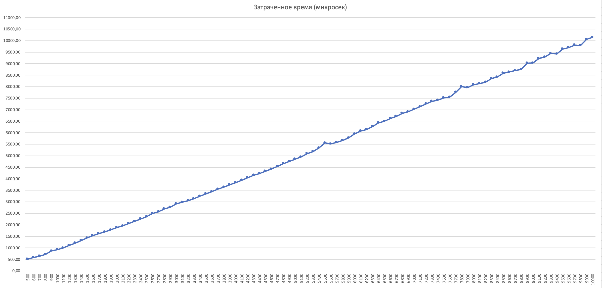

## A2. Анализ MERGE+INSERTION SORT

## Демченко Георгий Павлович , БПИ-235

## 1. Реализация гибридного алгоримта сортировки MERGE+INSERTION Sort

**Id посылки на CodeForces : 292503879**

**GitHub : [Sorts.cpp](https://github.com/AvtorPaka/Alg-DS/tree/master/src/SET_3/AnalysisTasks/A2/Sorts.cpp)**


## 2. Реализация внутренней инфраструктуры для экспериментального анализа

### ArrayGenerator

**GitHub : [ArrayGenerator.cpp](https://github.com/AvtorPaka/Alg-DS/tree/master/src/SET_3/AnalysisTasks/A2/ArrayGenerator.cpp)**

**Если ссылка на GitHub недоступна, в конце файла приложены code блоки с реализацией**


### SortTester

**GitHub : [SortTester.cpp](https://github.com/AvtorPaka/Alg-DS/tree/master/src/SET_3/AnalysisTasks/A2/SortTester.cpp)**

**Если ссылка на GitHub недоступна, в конце файла приложены code блоки с реализацией**


## 3. Представление эмпирических замеров времени работы алгоритмов

**Исходные данные эмипрических замеров : [testResultData](https://github.com/AvtorPaka/Alg-DS/tree/master/src/SET_3/AnalysisTasks/A2/testResultData)**

**Общие параметры тестирования:**
- Диапазон размеров тестовых массивов: 500-10000
- Шаг размера тестовых массивов: 100
- Диапазон случайных значений в массивах: 0-6000
- Количество тестов для усреднения (коэфицент усреднения): 20
- Способ усреднения: среднее арифметическое
- Количество переставленных элементов в частично-отсортированных массивах длинны N: $\left[\frac{N}{10}\right]$

**В результатах каждого теста ([testResultData](https://github.com/AvtorPaka/Alg-DS/tree/master/src/SET_3/AnalysisTasks/A2/testResultData)) написаны  параметры тестирования**

**Время работы алгоритмов посчитано в микросекундах**

## Стандартный Merge Sort (Base Merge Sort)

### Неотсортированные массивы с случайными значениями из диапазона



### Массивы, отсортированные в обратном порядке по невозрастанию


### Частично-отсортированные массивы


## Гибридный Merge Sort (Merge+Insertion Sort)

**Название рядов отражает Insertion Sort threshold**

### Неотсортированные массивы с случайными значениями из диапазона


### Массивы, отсортированные в обратном порядке по невозрастанию


### Частично-отсортированные массивы


## 4. Сравнительный анализ

**Стандартный Merge Sort**
- В каждой категории тестовых данных показывает приблизительно одинаковые (с максимальной разницой в $\approx 500$ микросекунд) затраты по времени, несмотря на принципиальное отличие в тестовых наборах
- Лучший результат времени выполнения имеет категория тестов 2 - "Массивы, отсортированные в обратном порядке по невозрастанию", что несколько удивительно (подобная закономерность наблюдается и у MERGE+INSERTION Sort)
- Наблюдается равномерный рост временных затрат при увеличении размеров тестовых массивов, без резких скачков (в отличии от MERGE+INSERTION Sort)

**Merge+Insertion Sort**
- Наибольшие временные затраты приходятся на 1-ую категорию тестов с произвольными массивами вне зависимости от threshold
- Наименьшие временные затрты алгоритм показывает во 2-ой и 3-ей категории тестов при threshold - 20,30,50, при этом во 2ой категории тестов временные показатели при данных threshold практически идентичны
- Временные затраты алгоритма с threshold - 10,20,30,50 идут закономерными скачками, что можно наблюдат в каждой из категорий, когда реализация с меньшим порогом имеет резкое увеличение времени исполнения и начинает превышать время более высоких порогов, но при увеличении размера массива N и у них происходит скачок, выравнивающий на некоторый промежуток размеров массива их время исполнения.
- Можно сказать что параметр threshold регулирует размеры массива N, начиная с которых идут скачки времени исполнения, увеличивая/растягивая их при увеличении параметра (наиболее явно заметно в 3-ей категории)
- В каждой категории тестов присутствует неравномерные скачки времени выполнения алгоритма в зависимости от threshold (threshold 5,10,20 начиная с N > 5000)
- Затраченное время резко сокращается во всех категориях тестов при переходе с threshold 5-10 на threshold >= 20, и остается приблизительно одинаковым при threshold - 20,30,50, наиболее явно это заметно на 2ой категории тестов.

**Вывод**

- Гибридная версия алгоритма имеет как минимум в 2 раза меньшие временные затраты (threshold = 5), как максимум в $\approx 3$ (threshold = 50) по сравнению с обычной версией во всех категориях тестов при любом threshold (из рассмотренных)
- Макисмальные временные затрарты гибридного алгоритма $\approx 5$ мс (1ая категория тестов, N = 10000, threshold = 5),в то время как обычная реализация в каждой категории тестов достигала значений $\approx 10$ мс
- Гибридная реализация очевидно выгодней "наивной" в виду легкой реализации и существенного ($\approx 2.5$) ускорения работы алгоритма

## Реализация ArrayGenerator.cpp & SortTester.cpp


## ArrayGenerator.h

```cpp
#ifndef IMPLEMENTATIONDATA_ARRAYGENERATOR_H
#define IMPLEMENTATIONDATA_ARRAYGENERATOR_H
#include <vector>
#include <cstdint>

class ArrayGenerator {
public:
    static std::vector<int32_t> GenerateArrayWithRange(size_t size, int32_t min, int32_t max);
    static std::vector<int32_t> GenerateReverseSortedArray(size_t size, int32_t min, int32_t max);
    static std::vector<int32_t> GenerateParticleSortedArray(size_t size, int32_t min, int32_t max, int32_t particleSortedRate);
};


#endif //IMPLEMENTATIONDATA_ARRAYGENERATOR_H
```

## ArrayGenerator.cpp

```cpp
#include "ArrayGenerator.h"
#include <random>
#include <algorithm>

std::vector<int32_t> ArrayGenerator::GenerateArrayWithRange(size_t size, int32_t min, int32_t max) {
    std::random_device rd;
    std::mt19937 gen(rd());
    std::uniform_int_distribution<> dis(min, max);

    std::vector<int32_t> array(size);
    for (size_t i = 0; i < size; ++i) {
        array[i] = dis(gen);
    }

    return array;
}

std::vector<int32_t> ArrayGenerator::GenerateReverseSortedArray(size_t size, int32_t min, int32_t max) {
    std::vector<int32_t> array = GenerateArrayWithRange(size, min, max);

    std::sort(array.begin(), array.end(), std::greater<>());

    return array;
}

std::vector<int32_t> ArrayGenerator::GenerateParticleSortedArray(size_t size, int32_t min, int32_t max, int32_t particleSortedRate) {
    std::vector<int32_t> array = GenerateArrayWithRange(size, min, max);
    std::sort(array.begin(), array.end());

    std::random_device rd;
    std::mt19937 gen(rd());
    std::uniform_int_distribution<> dis(0, size - 1);

    for (int32_t i = 0; i < particleSortedRate; ++i) {
        std::swap(array[dis(gen)], array[dis(gen)]);
    }

    return array;
}
```

## SortTester.h

```cpp
#ifndef IMPLEMENTATIONDATA_SORTTESTER_H
#define IMPLEMENTATIONDATA_SORTTESTER_H
#include <cstdint>
#include <string>

class SortTester {
public:
    static void TestBaseMergeSortArrayWithRange(const std::string &dataFilePath, size_t minArrSize, size_t maxArrSize, size_t step, int32_t minVal, int32_t maxVal, int32_t averagingRate);

    static void TestBaseMergeSortReverseSortedArrays(const std::string &dataFilePath, size_t minArrSize, size_t maxArrSize, size_t step, int32_t minVal, int32_t maxVal, int32_t averagingRate);

    static void TestBaseMergeSortParticleSortedArrays(const std::string &dataFilePath, size_t minArrSize, size_t maxArrSize, size_t step, int32_t minVal, int32_t maxVal, int32_t averagingRate);

    static void TestHybridMergeSortParticleSortedArrays(const std::string &dataFilePath, size_t minArrSize, size_t maxArrSize, size_t step, int32_t minVal, int32_t maxVal, int32_t averagingRate, int32_t threshold);

    static void TestHybridMergeSortReverseSortedArrays(const std::string &dataFilePath, size_t minArrSize, size_t maxArrSize, size_t step, int32_t minVal, int32_t maxVal, int32_t averagingRate, int32_t threshold);

    static void TestHybridMergeSortArrayWithRange(const std::string &dataFilePath, size_t minArrSize, size_t maxArrSize, size_t step, int32_t minVal, int32_t maxVal, int32_t averagingRate, int32_t threshold);
};


#endif //IMPLEMENTATIONDATA_SORTTESTER_H

```


## SortTester.cpp

```cpp
#include "SortTester.h"
#include "ArrayGenerator.h"
#include <vector>
#include <chrono>
#include <fstream>
#include "Sorts.h"

void SortTester::TestBaseMergeSortArrayWithRange(const std::string &dataFilePath, size_t minArrSize, size_t maxArrSize, size_t step, int32_t minVal, int32_t maxVal, int32_t averagingRate) {

    std::ofstream dataFile(dataFilePath);
    dataFile << "Base Merge Sort\nTests results with random unsorted arrays\n\n";
    dataFile << "Range of test arrays size: " + std::to_string(minArrSize) + '-' + std::to_string(maxArrSize) +
                ". With step = " + std::to_string(step) + '\n';
    dataFile << "Range of random values: " + std::to_string(minVal) + '-' + std::to_string(maxVal) + '\n';
    dataFile << "Averaging rate = " + std::to_string(averagingRate) + "\n";
    dataFile << "N - array size\nT - averaged elapsed time (in microseconds)\n\nN : T\n";

    for (size_t curSize = minArrSize; curSize <= maxArrSize; curSize += step) {
        uint64_t timeSum = 0;
        std::vector<int32_t> array;

        for (int32_t j = 0; j < averagingRate; ++j) {
            array = ArrayGenerator::GenerateArrayWithRange(curSize, minVal, maxVal);

            auto start = std::chrono::high_resolution_clock::now();
            Sorts::BaseMergeSort(array, 0, curSize - 1);
            auto elapsed = std::chrono::high_resolution_clock::now() - start;
            uint64_t microsec = std::chrono::duration_cast<std::chrono::microseconds>(elapsed).count();
            timeSum += microsec;
        }

        double avgTime = (double) timeSum / averagingRate;
        dataFile << std::to_string(curSize) + " : " + std::to_string(avgTime) + '\n';
    }

    dataFile.close();
}

void SortTester::TestBaseMergeSortReverseSortedArrays(const std::string &dataFilePath, size_t minArrSize, size_t maxArrSize, size_t step, int32_t minVal, int32_t maxVal, int32_t averagingRate) {
    std::ofstream dataFile(dataFilePath);
    dataFile << "Base Merge Sort\nTests results with reverse sorted arrays\n\n";
    dataFile << "Range of test arrays size: " + std::to_string(minArrSize) + '-' + std::to_string(maxArrSize) +
                ". With step = " + std::to_string(step) + '\n';
    dataFile << "Range of random values: " + std::to_string(minVal) + '-' + std::to_string(maxVal) + '\n';
    dataFile << "Averaging rate = " + std::to_string(averagingRate) + "\n";
    dataFile << "N - array size\nT - averaged elapsed time (in microseconds)\n\nN : T\n";

    for (size_t curSize = minArrSize; curSize <= maxArrSize; curSize += step) {
        uint64_t timeSum = 0;
        std::vector<int32_t> array;

        for (int32_t j = 0; j < averagingRate; ++j) {
            array = ArrayGenerator::GenerateReverseSortedArray(curSize, minVal, maxVal);

            auto start = std::chrono::high_resolution_clock::now();
            Sorts::BaseMergeSort(array, 0, curSize - 1);
            auto elapsed = std::chrono::high_resolution_clock::now() - start;
            uint64_t microsec = std::chrono::duration_cast<std::chrono::microseconds>(elapsed).count();
            timeSum += microsec;
        }

        double avgTime = (double) timeSum / averagingRate;
        dataFile << std::to_string(curSize) + " : " + std::to_string(avgTime) + '\n';
    }

    dataFile.close();
}

void SortTester::TestBaseMergeSortParticleSortedArrays(const std::string &dataFilePath, size_t minArrSize, size_t maxArrSize, size_t step, int32_t minVal, int32_t maxVal, int32_t averagingRate) {
    std::ofstream dataFile(dataFilePath);
    dataFile << "Base Merge Sort\nTests results with particle sorted arrays\n\n";
    dataFile << "Range of test arrays size: " + std::to_string(minArrSize) + '-' + std::to_string(maxArrSize) +
                ". With step = " + std::to_string(step) + '\n';
    dataFile << "Range of random values: " + std::to_string(minVal) + '-' + std::to_string(maxVal) + '\n';
    dataFile << "Averaging rate = " + std::to_string(averagingRate) + "\n";
    dataFile << "Number of swapped elements = N/10\n";
    dataFile << "N - array size\nT - averaged elapsed time (in microseconds)\n\nN : T\n";

    for (size_t curSize = minArrSize; curSize <= maxArrSize; curSize += step) {
        uint64_t timeSum = 0;
        std::vector<int32_t> array;

        for (int32_t j = 0; j < averagingRate; ++j) {
            array = ArrayGenerator::GenerateParticleSortedArray(curSize, minVal, maxVal, curSize/10);

            auto start = std::chrono::high_resolution_clock::now();
            Sorts::BaseMergeSort(array, 0, curSize - 1);
            auto elapsed = std::chrono::high_resolution_clock::now() - start;
            uint64_t microsec = std::chrono::duration_cast<std::chrono::microseconds>(elapsed).count();
            timeSum += microsec;
        }

        double avgTime = (double) timeSum / averagingRate;
        dataFile << std::to_string(curSize) + " : " + std::to_string(avgTime) + '\n';
    }

    dataFile.close();
}

void SortTester::TestHybridMergeSortParticleSortedArrays(const std::string &dataFilePath, size_t minArrSize, size_t maxArrSize, size_t step, int32_t minVal, int32_t maxVal, int32_t averagingRate, int32_t threshold) {
    std::ofstream dataFile(dataFilePath);
    dataFile << "Hybrid Merge Sort\nTests results with particle sorted arrays\n\n";
    dataFile << "Insertion sort threshold = " + std::to_string(threshold) + '\n';
    dataFile << "Range of test arrays size: " + std::to_string(minArrSize) + '-' + std::to_string(maxArrSize) +
                ". With step = " + std::to_string(step) + '\n';
    dataFile << "Range of random values: " + std::to_string(minVal) + '-' + std::to_string(maxVal) + '\n';
    dataFile << "Averaging rate = " + std::to_string(averagingRate) + "\n";
    dataFile << "Number of swapped elements = N/10\n";
    dataFile << "N - array size\nT - averaged elapsed time (in microseconds)\n\nN : T\n";

    for (size_t curSize = minArrSize; curSize <= maxArrSize; curSize += step) {
        uint64_t timeSum = 0;
        std::vector<int32_t> array;

        for (int32_t j = 0; j < averagingRate; ++j) {
            array = ArrayGenerator::GenerateParticleSortedArray(curSize, minVal, maxVal, curSize/10);

            auto start = std::chrono::high_resolution_clock::now();
            Sorts::HybridMergeSort(array, 0, curSize - 1, threshold);
            auto elapsed = std::chrono::high_resolution_clock::now() - start;
            uint64_t microsec = std::chrono::duration_cast<std::chrono::microseconds>(elapsed).count();
            timeSum += microsec;
        }

        double avgTime = (double) timeSum / averagingRate;
        dataFile << std::to_string(curSize) + " : " + std::to_string(avgTime) + '\n';
    }

    dataFile.close();
}

void SortTester::TestHybridMergeSortReverseSortedArrays(const std::string &dataFilePath, size_t minArrSize, size_t maxArrSize, size_t step, int32_t minVal, int32_t maxVal, int32_t averagingRate, int32_t threshold) {
    std::ofstream dataFile(dataFilePath);
    dataFile << "Hybrid Merge Sort\nTests results with reverse sorted arrays\n\n";
    dataFile << "Insertion sort threshold = " + std::to_string(threshold) + '\n';
    dataFile << "Range of test arrays size: " + std::to_string(minArrSize) + '-' + std::to_string(maxArrSize) +
                ". With step = " + std::to_string(step) + '\n';
    dataFile << "Range of random values: " + std::to_string(minVal) + '-' + std::to_string(maxVal) + '\n';
    dataFile << "Averaging rate = " + std::to_string(averagingRate) + "\n";
    dataFile << "N - array size\nT - averaged elapsed time (in microseconds)\n\nN : T\n";

    for (size_t curSize = minArrSize; curSize <= maxArrSize; curSize += step) {
        uint64_t timeSum = 0;
        std::vector<int32_t> array;

        for (int32_t j = 0; j < averagingRate; ++j) {
            array = ArrayGenerator::GenerateReverseSortedArray(curSize, minVal, maxVal);

            auto start = std::chrono::high_resolution_clock::now();
            Sorts::HybridMergeSort(array, 0, curSize - 1, threshold);
            auto elapsed = std::chrono::high_resolution_clock::now() - start;
            uint64_t microsec = std::chrono::duration_cast<std::chrono::microseconds>(elapsed).count();
            timeSum += microsec;
        }

        double avgTime = (double) timeSum / averagingRate;
        dataFile << std::to_string(curSize) + " : " + std::to_string(avgTime) + '\n';
    }

    dataFile.close();
}

void
SortTester::TestHybridMergeSortArrayWithRange(const std::string &dataFilePath, size_t minArrSize, size_t maxArrSize, size_t step, int32_t minVal, int32_t maxVal, int32_t averagingRate, int32_t threshold) {
    std::ofstream dataFile(dataFilePath);
    dataFile << "Hybrid Merge Sort\nTests results with random unsorted arrays\n\n";
    dataFile << "Insertion sort threshold = " + std::to_string(threshold) + '\n';
    dataFile << "Range of test arrays size: " + std::to_string(minArrSize) + '-' + std::to_string(maxArrSize) +
                ". With step = " + std::to_string(step) + '\n';
    dataFile << "Range of random values: " + std::to_string(minVal) + '-' + std::to_string(maxVal) + '\n';
    dataFile << "Averaging rate = " + std::to_string(averagingRate) + "\n";
    dataFile << "N - array size\nT - averaged elapsed time (in microseconds)\n\nN : T\n";

    for (size_t curSize = minArrSize; curSize <= maxArrSize; curSize += step) {
        uint64_t timeSum = 0;
        std::vector<int32_t> array;

        for (int32_t j = 0; j < averagingRate; ++j) {
            array = ArrayGenerator::GenerateArrayWithRange(curSize, minVal, maxVal);

            auto start = std::chrono::high_resolution_clock::now();
            Sorts::HybridMergeSort(array, 0, curSize - 1, threshold);
            auto elapsed = std::chrono::high_resolution_clock::now() - start;
            uint64_t microsec = std::chrono::duration_cast<std::chrono::microseconds>(elapsed).count();
            timeSum += microsec;
        }

        double avgTime = (double) timeSum / averagingRate;
        dataFile << std::to_string(curSize) + " : " + std::to_string(avgTime) + '\n';
    }

    dataFile.close();
}

```