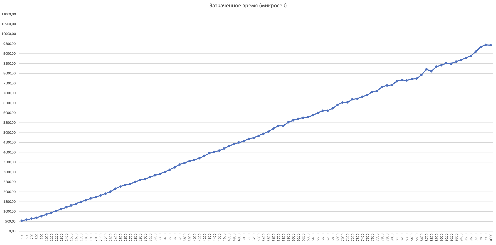
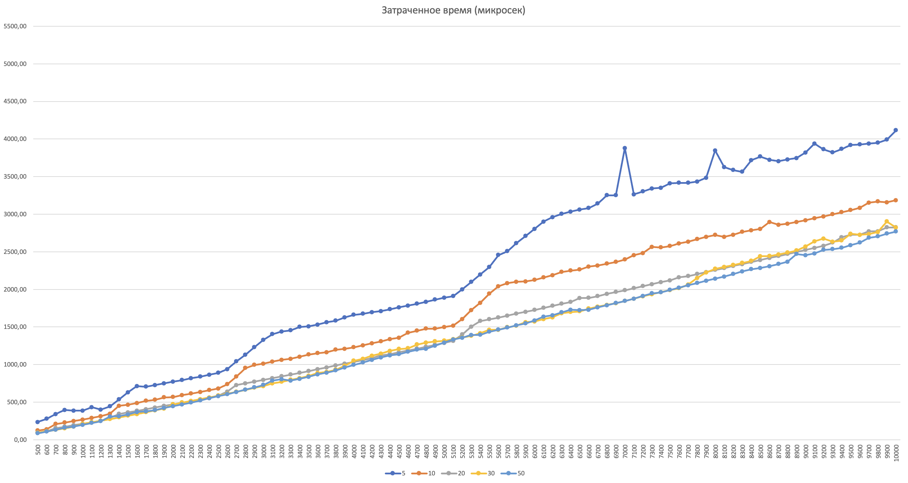

## A2. Анализ MERGE+INSERTION SORT

**Демченко Георгий Павлович , БПИ-235**

[Условие](https://github.com/AvtorPaka/Alg-DS/blob/master/src/SET_3/AnalysisTasks/spec/spec_2.pdf)

### 1. Реализация гибридного алгоримта сортировки MERGE+INSERTION Sort

**Id посылки на CodeForces : 292503879**

- [Sorts.h](https://github.com/AvtorPaka/Alg-DS/tree/master/src/SET_3/AnalysisTasks/A2/Sorts.h)
- [Sorts.cpp](https://github.com/AvtorPaka/Alg-DS/tree/master/src/SET_3/AnalysisTasks/A2/Sorts.cpp)

### 2. Реализация внутренней инфраструктуры для экспериментального анализа

**ArrayGenerator**

- [ArrayGenerator.h](https://github.com/AvtorPaka/Alg-DS/tree/master/src/SET_3/AnalysisTasks/A2/ArrayGenerator.h)
- [ArrayGenerator.cpp](https://github.com/AvtorPaka/Alg-DS/tree/master/src/SET_3/AnalysisTasks/A2/ArrayGenerator.cpp)

**SortTester**

- [SortTester.h](https://github.com/AvtorPaka/Alg-DS/tree/master/src/SET_3/AnalysisTasks/A2/SortTester.h)
- [SortTester.cpp](https://github.com/AvtorPaka/Alg-DS/tree/master/src/SET_3/AnalysisTasks/A2/SortTester.cpp)

### 3. Представление эмпирических замеров времени работы алгоритмов

**Исходные данные эмипрических замеров : [testResultData](https://github.com/AvtorPaka/Alg-DS/tree/master/src/SET_3/AnalysisTasks/A2/testResultData)**

**Общие параметры тестирования:**
- Диапазон размеров тестовых массивов: 500-10000
- Шаг размера тестовых массивов: 100
- Диапазон случайных значений в массивах: 0-6000
- Количество тестов для усреднения (коэфицент усреднения): 20
- Способ усреднения: среднее арифметическое
- Количество переставленных элементов в частично-отсортированных массивах длинны N: $\left[\frac{N}{10}\right]$
- Время работы алгоритмов измеряется в **микросекундах**

**В результатах каждого теста написаны  параметры тестирования**

### Стандартный Merge Sort (Basic Merge Sort)

| **Набор тестовых данных**  | **Время исполнения**  |
| ------- | ------- |
| **Неотсортированные массивы с случайными значениями из диапазона**  |   |
| **Массивы, отсортированные в обратном порядке по невозрастанию**  |   |
| **Частично-отсортированные массивы**  |   |

### Гибридный Merge Sort (Merge+Insertion Sort)

*Название рядов отражает Insertion Sort threshold*

| **Набор тестовых данных**  | **Время исполнения**  |
| ------- | ------- |
| **Неотсортированные массивы с случайными значениями из диапазона**  |   |
| **Массивы, отсортированные в обратном порядке по невозрастанию**  |   |
| **Частично-отсортированные массивы**  |  |

### 4. Сравнительный анализ

**Стандартный Merge Sort**
- В каждой категории тестовых данных показывает приблизительно одинаковые (с максимальной разницой в $\approx 500$ микросекунд) затраты по времени, несмотря на принципиальное отличие в тестовых наборах
- Лучший результат времени выполнения имеет категория тестов 2 - "Массивы, отсортированные в обратном порядке по невозрастанию", что несколько удивительно (подобная закономерность наблюдается и у MERGE+INSERTION Sort)
- Наблюдается равномерный рост временных затрат при увеличении размеров тестовых массивов, без резких скачков (в отличии от MERGE+INSERTION Sort)

**Merge+Insertion Sort**
- Наибольшие временные затраты приходятся на 1-ую категорию тестов с произвольными массивами вне зависимости от threshold
- Наименьшие временные затрты алгоритм показывает во 2-ой и 3-ей категории тестов при threshold - 20,30,50, при этом во 2ой категории тестов временные показатели при данных threshold практически идентичны
- Временные затраты алгоритма с threshold - 10,20,30,50 идут закономерными скачками, что можно наблюдат в каждой из категорий, когда реализация с меньшим порогом имеет резкое увеличение времени исполнения и начинает превышать время более высоких порогов, но при увеличении размера массива N и у них происходит скачок, выравнивающий на некоторый промежуток размеров массива их время исполнения.
- Можно сказать что параметр threshold регулирует размеры массива N, начиная с которых идут скачки времени исполнения, увеличивая/растягивая их при увеличении параметра (наиболее явно заметно в 3-ей категории)
- В каждой категории тестов присутствует неравномерные скачки времени выполнения алгоритма в зависимости от threshold (threshold 5,10,20 начиная с N > 5000)
- Затраченное время резко сокращается во всех категориях тестов при переходе с threshold 5-10 на threshold >= 20, и остается приблизительно одинаковым при threshold - 20,30,50, наиболее явно это заметно на 2ой категории тестов.

### Вывод

- Гибридная версия алгоритма имеет как минимум в 2 раза меньшие временные затраты (threshold = 5), как максимум в $\approx 3$ (threshold = 50) по сравнению с обычной версией во всех категориях тестов при любом threshold (из рассмотренных)
- Макисмальные временные затрарты гибридного алгоритма $\approx 5$ мс (1ая категория тестов, N = 10000, threshold = 5),в то время как обычная реализация в каждой категории тестов достигала значений $\approx 10$ мс
- Гибридная реализация очевидно выгодней "наивной" в виду легкой реализации и существенного ($\approx 2.5$) ускорения работы алгоритма

