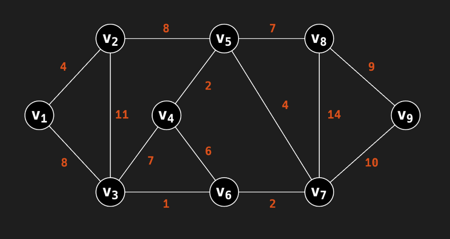
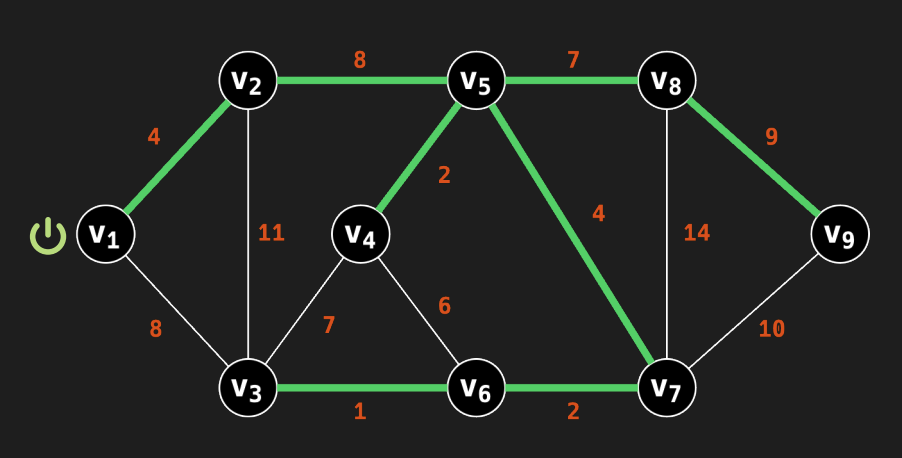

## A1. Как построить минимальный остов?

### Демченко Георгий Павлович , БПИ-235

## 1. Эффективная реализация алгоритмов, использование структур данных

Пусть дан граф $G = (V, E)$, где $V$ - множество вершин графа, $E$ - множество ребер графа.Для простоты написания символами $V,E$ также будем обозначать мощности соотвествующих множеств.

Для всех алгоритмов будем считать, что граф передается в формате необходимых структур данных (пример - передается двусвязный список ребер).

Во всех "реализациях" алгоритмов на C++ используется тип $int$ для определения вершины графа, на деле это может быть любой тип.

## 1. $ALG_{1}$

**1.1** 

Для хранения ребер $E$ графа в порядке невозрастания весов выгоднее всего использовать обычный отсортированный массив, так как на его построение (сортировку) потребуется $O(E \cdot log(E))$ с последующим доступом к максимальному (требуемому) ребру за $O(1)$ без необходимости в удалении.

**1.2** 

Для эффективного удаления ребер из множества $T$ будем хранить все ребра в двусвязном списке, в той же последовательности, что и в отсортированном множестве $E$, тогда на любом шаге мы знаем иттератор на элемент в списке и можем удалить его за $O(1)$

**Примечание :** Если под $T=E$ имелось в виду не только равенство множеств, но и равенство структур данных, которые хранят эти множества, то также используем двусвязный список для хранения ребер $E$.

**1.3** 

Для определения связности графа после удаления ребра из множества $T$ можно выбрать несколько подходов (также опишем неподходящие):

- После каждого удаления ребра проверять на связность при помощи DFS/BFS (считать кол-во компонент свзяности, что дает идентичную ассимптотику) - $O(E + V)$

- Так как каждое ребро, приводящее к потере связности в графе является мостом, можно также находить мосты после каждого удаления ребра и удалять ребра, не являющиеся мостами на текущем шаге, что также потребует $O(E + V)$

- Использовать стандартный UNION-FIND (на основе "деревьев") для облегчения ассимптотики и проверки принадлежности вершин удаленного ребра одному множеству невозможно, так как структура не поддерживает удаление, что требуется по алгоритму.

- Можно заранее посчитать остовное дерево алгоритмом Краскала за $O(E \cdot log(E))$ (даже за $O(a(E))$ так как сортировка уже выполнена) и удалять только те ребра, что не входят в остовное дерево (так мы всегда будем иметь связный граф при удалении ребра), тогда проверка на удаление будет занимать $O(1)$, но не будем рассматривать данный вариант так как он является решением задачи для решения такой же задачи.

- Использовать [Link-Cut Tree](https://neerc.ifmo.ru/wiki/index.php?title=Link-Cut_Tree) для определения принадлежности вершин удаленного ребра одной компоненте связности с амортизированным временем выполнения операций $O(log(V))$. **Будем использовать данный подход как самый оптимальный.**

Тогда для построения Link-Cut Tree нам понадобится 

$O(\sum_{i = 1}^{E}(log(2i))) = O(log(\prod_{i = 1}^{E}(2i))) = O(log(2^{E} \cdot E!)) =$

$= O((E - 1) + log(E!)) \approx$

$\approx O((E - 1) +E \cdot log(E) - E \cdot log(e) + O(log(E))) = O(E \cdot log(E))$

операций (добавляем каждое реброе из $E$ - $(u, v)$ link(u, v), для оценки сверху считаем что при каждом добавлении кол-во имеющихся элементов увеличивается на 2, изначально элементов нет)

Можно было оценить чуть грубее, сказав что каждая операция добавления имеет асимптотику $O(log(V))$, тогда затраты на построение $ = O(E \cdot log(V))$.

Каждая из операций: удаление ребра, присоединение ребра, удостоверение связности (поиск корней у вершин удаленного ребра) имеет асимптотику $O(log(V))$

**1.4**

**Зная все вышеперечисленное,  посчитаем наиболее эффективную ассимптотику, при использовании Link-Cut Tree:**

$T_{ALG_{1}} = O(E \cdot log(E) + E \cdot log(E) + E \cdot log(V)) = O(E \cdot log(E) + E \cdot log(V)) =$

$= O(E \cdot log(EV)) = O(E \cdot log(\frac{(V - 1) \cdot V^{2}}{2})) = O(E \cdot log(V))$

**При использовании альтернативного подхода - DFS/BFS, асимптотика сильно деградирует:**

$T_{ALG_{1}} = O(E \cdot log(E) + E \cdot log(E) + E \cdot (E + V)) = O(E^2 + EV)$

**1.5**

**Исходный код представлен в файле ALG_1.cpp**

## 2. $ALG_{2}$

Под $e \in E$, выбранное случайным образом, будем понимать, что исходное множество ребер $E$ не преобразовано (как пример - отсортированно) и ребра в нем могут располагаться произвольно. (т.е на каждой итерации мы не берем произвольное ребро из всего множества, а идем подряд по списку всех "необработанных" ребер)

**2.1**

В качестве структуры данных для хранения множества $T$ подойдет любая с добавлением за $O(1)$, будем использовать простой массив.

**2.2**

Для определения, образует ли множество $T \space \cup \space \{e\}$ граф без циклов, будем пользоваться структурой UNION-FIND на основе деревьев, с средним асимптотическим поведением операций $O(a(V))$, где $a(n)$ - функция, обратная к функции Аккермана $A(n,m)$, так как структура предназначена для работы с добавлением элементов (объединением вершин).

Ассимптотика инициализации UNION-FIND  - $O(V)$, добавление всех вершин графа в качестве отдельных множеств за $O(1)$.

Проверка на цикл - $O(a(V))$

**2.3**

**Зная все вышеперечисленное,  посчитаем наиболее эффективную ассимптотику, при использовании UNION-FIND:**

$T_{ALG_{2}} = O(V + E \cdot a(V)) = O(E \cdot a(V))$ 

**2.4**

**Исходный код представлен в файле ALG_2.cpp**

## 3. $ALG_{3}$

Под $e \in E$, выбранное случайным образом, будем понимать, что исходное множество ребер $E$ не преобразовано (как пример - отсортированно) и ребра в нем могут располагаться произвольно. (т.е на каждой итерации мы не берем произвольное ребро из всего множества, а идем подряд по списку всех "необработанных" ребер)

В данной задаче требуется как добавление так и удаление ребер из множества $T$, скомбинируем подоходы $ALG_{1}$
и $ALG_{2}$ по использованию структур данных для определения циклов и поиска максимального ребра на пути между вершинами, т.е будем использовать UNION-FIND и Link-Cut Tree.

**3.1**

Для эффективного удаления ребер из множества $T$ можем хранить все ребра в двусвязном списке, тогда удаление будет происходить за $O(1)$, но необходимо где-то сохранять итераторы для быстрого доступа к удаляемому ребру, однако хранить такие итераторы в вершинах UNION-FIND или Link-Cut Tree затруднительно и может потребовать $O(V)$ затрат на нахождение в случаях когда вершины имеют большую степень. 

Поэтому выгоднее в данном случае использовать soft-delete (хэш таблица, ключ-ребро, значение-включено/не включено) для "удаления" за $O(1)$ из множества $T$ c инициализацией и последующем составлении корректного $T$ по удаленным ребрам за $O(E)$.

**3.2**

Для определения цикла из ребер $c \subseteq T$ будем использовать UNION-FIND на основе "деревьев" аналогично $ALG_{2}$, проверять на принадлежность одному множеству перед физическим добавлением.

Ассимптотика инициализации UNION-FIND  - $O(V)$, добавление всех вершин графа в качестве отдельных множеств за $O(1)$.

Проверка на цикл, объединение множеств которым принадлежат вершины - $O(a(V))$

**3.3**

Так как перед добавлением такого ребра $e$ в множество $T$, которое образует в нем цикл, $T$ представляет из себя дерево и физического добавления мы не производим, то между вершинами $(u, v)$ добавляемого ребра $e$ существует путь, притом единственный, тогда нам необходимо найти макисмальное по весу ребро среди ребер в этом пути и добавляемым ребром при помощи Link-Cut Tree за $O(log(V))$ (операция path(u, v) и хранение веса ребер в вершинах LCT), и удалить его из LCT при помощи cut(u, v) за $O(log(V))$ или же не добавлять новое ребро вовсе (если оно максимальное).

При этом производить какие-то операции удаления с UNION-FIND не нужно, так как принадлежность вершин множествам не изменилась.

**3.4**

**Зная все вышеперечисленное,  посчитаем наиболее эффективную ассимптотику, при использовании UNION-FIND и Link-Cut Tree:**

$T_{ALG_{3}} = O(E + V + E \cdot (a(V) + log(V))) = O(E \cdot (a(V) + log(V))) = O(E \cdot log(V))$ 

**3.5**

**Исходный код представлен в файле ALG_3.cpp**

## 2. Формирование MST

## 1. $ALG_{1}$

Формируется ли в множестве $T$ MST? - **Да**

**Обоснование :**

Ребра удаляются в порядке невозрастания весов, сохраняя связность графа. Это равносильно выбору рёбер с минимальным весом, так как удаляются только те рёбра, которые не нарушают связность и не входят в MST.

**Пример :**

Пусть имеется следующий граф $G$

Тогда, отсортировав ребра $E$ получим следующий список:

$\left[V_7V_8, V_2V_3, V_7V_9, V_8V_9, V_2V_5, V_1V_3, V_3V_4, V_5V_8, V_4V_6, V_1V_2, V_5V_7, V_4V_5, V_6V_7, V_3V_6 \right]$

Удаляем ребра в последовательности:

- $V_7V_8$ - граф связный, убираем.

- $V_2V_3$ - граф связный, убираем.

- $V_7V_9$ - граф связный, убираем.

- $V_8V_9$ - граф не связный, оставляем.

- $V_1V_3$ - граф связный, убираем.

- $V_2V_5$ - граф не связный, оставляем.

- $V_3V_4$ - граф связный, убираем.

- $V_5V_8$ - граф не связный, оставляем.

- $V_4V_6$ - граф связный, убираем.

- $V_1V_2$ - граф не связный, оставляем.

- $V_5V_7$ - граф не связный, оставляем.

- $V_4V_5$ - граф не связный, оставляем.

- $V_6V_7$ - граф не связный, оставляем.

- $V_3V_6$ - граф не связный, оставляем.

После всего прохода по ребрам $E$ остался в точности MST (в данном случае MST не единтвенен)

## 2. $ALG_{2}$

Формируется ли в множестве $T$ MST? - **Нет**

**Обоснование :**

Так как ребра при попытке добавления выбираются случайно (расположены случайно при добавлении), то может произойти ситуация, когда тяжелое ребро, не входящее в MST, будет добавлено в начале прохода по ребрам (составления $T$) и не будет образовывать цикл (например, было выбрано первым).

**Пример :**

Пусть $G = (V;E) = (\{V_{1}, V_{2}, V_{3}\}; \{(V_{1}V_{2}, 1), (V_{1}V_{3}, 2), (V_{2}V_{3}, 3)\})$

Если первым ребром при добавлении будет выбрано $V_{2}V_{3}$, (а оно добавится так как $T$ пустое и не может образовать циклов), то какое бы ребро не шло после него на добавление мы никогда не сможем добится MST = $\{V_1V_2, V_1V_3\}$ (из-за образования циклов и отсутсвия удаления тяжелых ребер)

## 3. $ALG_{3}$

Формируется ли в множестве $T$ MST? - **Да**

**Обоснование :**

Строя дерево на каждом шаге (избавляясь от циклов, оставляя единую компоненту связности) и удаля максимальное по весу ребро в цикле мы удволетворяем свойству MST - [Cycle property](https://en.wikipedia.org/wiki/Minimum_spanning_tree#Cycle_property), и строим его.

**Пример :**

Пусть $G = (V;E) = (\{V_{1}, V_{2}, V_{3}\}; \{(V_{1}V_{2}, 1), (V_{1}V_{3}, 2), (V_{2}V_{3}, 3)\})$

Если первым ребром при добавлении будет выбрано $V_{2}V_{3}$, то при последующих добавлениях ребер $V_1V_2, V_1V_3$ образуется цикл, из которого мы удалим $V_{2}V_{3}$ как самое тяжело ребро, образовав MST = $\{V_1V_2, V_1V_3\}$.