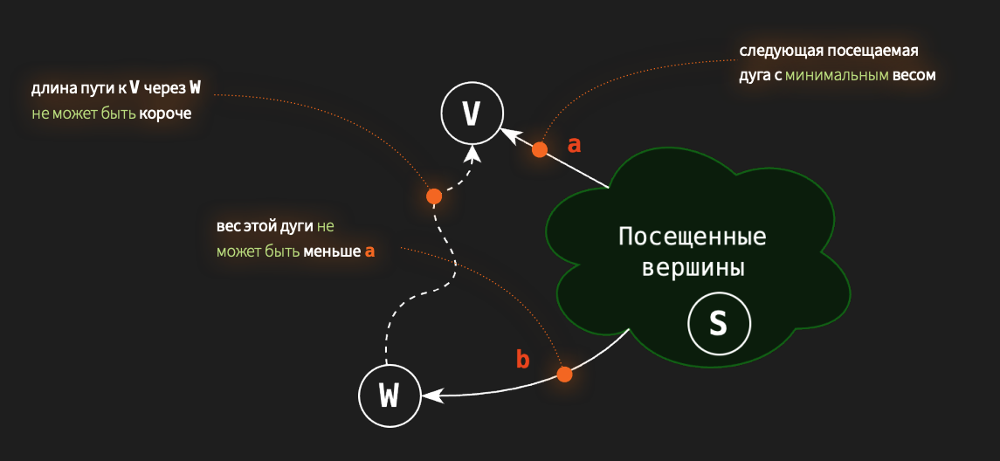
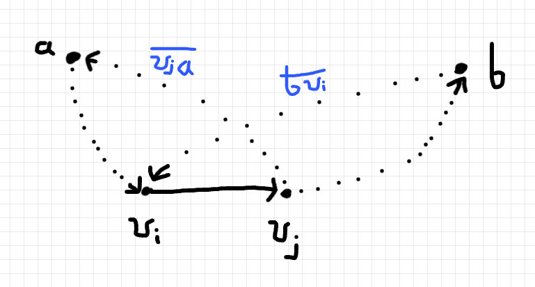

## A2. Кратчайший блиц!

**Демченко Георгий Павлович , БПИ-235**

[Условие](https://github.com/AvtorPaka/Alg-DS/tree/master/src/SET_6/AnalysisTasks/A2/spec.pdf)

## 1. $DijkstraMULT(G, start)$

**Модифицированный алгоритм представлен в файле DijkstraMULT.cpp**

Алгоритм будет корректно искать кратчайшие пути для графов $G$ с весами ребер $\geq 1$, так как в ином случае:

- Если граф имеет ребра c весом $\in \left[0, 1\right)$, то нарушается свойство подпутей



Пусть в данном случае длинна $SV = 5$, $SW = 100$, $WV = \frac{1}{100}$, по алгоритму мы возьмем путь $SV$ как минимальный, но в действительности минимальный путь будет $SW -> WV$. По алгоритму мы получим минимальный путь от вершины $S$ до вершины $V$ равному $5$, когда в действительности минимальный равен $SW \cdot WV = 1$

- Аналогично с графом с ребрами весом $< 0$, как и стандартный Дейкстра, данный алгоритм не сможет корректно обработать такой граф.

Пусть в данном случае длинна $SV = -5$, $SW = 100$, $WV = -1$, по алгоритму мы возьмем путь $SV$ как минимальный, но в действительности минимальный путь будет $SW -> WV$. По алгоритму мы получим минимальный путь от вершины $S$ до вершины $V$ равному $-5$, когда в действительности минимальный равен $SW \cdot WV = -100$

## 2. $RestoreGraph(dist[][])$

### Алгоритм 

**Реализация алгоритма представлена в файле RestoreGraph.cpp**

В матрице кратчайших путей $dist[][]$ нам даны лишь их веса, а не информация о вершине, откуда мы попали в конечную на последнем шаге, поэтому восстановить мы можем только "прямые"/критические ребра между вершинами, которые и являются минимальным путем между ними.

Тогда, для каждого минимального пути $dist[i][j]$, при условии что он существует, мы будем проверять, существует ли вершина $k$ сумма весов путей через которую от вершины $i$ до вершины $j$ равна весу минимального пути от $i$ до $j$ (т.е $dist[i][j] = dist[i][k] + dist[k][j]$), если такая вершина $k$ находится, то прямого ребра между $i$, $j$, скорее всего (так как может существовать несколько минимальных путей, один из которых можем быть "прямым" - ребром) нет и в множество ребер графа оно не добавляется , иначе добавляем ребро $ij$ в множество ребер графа.

**Ассимптотическая временная сложность алгоритма** = $O(V^3)$

### Случаи неоднозначного восстановления графа 

Да, существует множество случаев, когда однозначное восстановление графа данным алгоритмом по матрице $dist$ невозможно:

- Если в матрице существует несколько кратчайщих путей от вершины $i$ до вершины $j$, в данном случае так как могут существовать несколько кобинаций ребер, дающих одинаковую матрицу $dist$, то восстановить исходные ребра полностью невозможно.

- Если в матрице существует несколько кратчайших путей от вершины $i$ до вершины $j$, и один из них равен самому ребру $ij$, тогда ребро не будет восстановлено, так как по матрице весов кратчайщих путей мы никак не сможем узнать о его существовании, что уже упоминалось выше.

- Если в графе существует "тяжелые" ребра между вершинами $i$ и $j$, вес которых превышает вес минимального пути между этими вершинами, то они никак не могут числиться в матрице $dist$ и соответсвенно, будут упущены при востановлении.

- Дополнительные ребра, не влияющие на минимальные пути будут утеряны в ходе восстановления, так как информация о них не закреплена в матрице $dist$

Данный алгоритм восстанавливает граф с минимальным числом ребер, соответсвующих матрице $dist$, для однозначности необходимо, чтобы все рёбра графа  входили в единственный кратчайший путь между своими концами, т.е каждое ребро являлось минимальным путем между вершинами.

## 3. $FloydWarshallError$


### Ошибочная реализация алгоритма Флойда-Уоршелла

```cpp
for (int32_t i = 0; i < n; ++i) {
        for (int32_t j = 0; j < n; ++j) {
            for (int32_t k = 0; k < n; ++k) {
                dist[i][j] = min(dist[i][j], dist[i][k] + dist[k][j])
            }
        }
    }
```

**Ошибка допущена в порядке выбора вершины $k$ (порядке циклов), через которую должны считаться пути между вершинами.**

Эта ошибка приводит к тому, что промежуточные вершины $k$ не обрабатываются последовательно и минимальные пути через них могут не обновится.

### Пример графа

$G = \{\{V_{0}, V_{1}, V_{2}, V_{3}, V_{5}\}, ...\}$
**Изначальная матрица минимальных путей $dist$:**

$$
dist = 
\begin{pmatrix} 
0 & \infty & 8 & \infty & 8 \\
5 & 0 & 6 & 7 & \infty \\
\infty & \infty & 0 & \infty & 9\\
7 & \infty & 4 & 0 & 2 \\
\infty & 2 & \infty & 4 & 0
\end{pmatrix} \\
$$

### Частичная трассировка

Для сохранения пространства оставим только часть операций, влияющих на значение минимального пути.

- i = 0 j = 0
  - **Ничего не меняется**

- i = 0 j = 1
  - **Ничего не меняется**
  - k = 4 dist[0][1] = min( dist[0][1], dist[0][4] + dist[4][1]) = min(inf, 8 + 2) = 10

- i = 0 j = 2
  - **Ничего не меняется**
- i = 0 j = 3
  - k = 0 dist[0][3] = min( dist[0][3], dist[0][0] + dist[0][3]) = min(inf, 0 + inf) = inf
  - k = 1 dist[0][3] = min( dist[0][3], dist[0][1] + dist[1][3]) = min(inf, 10 + 7) = 17
  - k = 2 dist[0][3] = min( dist[0][3], dist[0][2] + dist[2][3]) = min(17, 8 + inf) = 17
  - k = 3 dist[0][3] = min( dist[0][3], dist[0][3] + dist[3][3]) = min(17, 17 + 0) = 17
  - k = 4 dist[0][3] = min( dist[0][3], dist[0][4] + dist[4][3]) = min(17, 8 + 4) = 12

- i = 0 j = 4
  - **Ничего не меняется**

- i = 1 j = 0
  - **Ничего не меняется**
  
- i = 1 j = 1
  - **Ничего не меняется**

- i = 1 j = 2
  - **Ничего не меняется**

- i = 1 j = 3
  - **Ничего не меняется**

- i = 1 j = 4
  - k = 0 dist[1][4] = min( dist[1][4], dist[1][0] + dist[0][4]) = min(inf, 5 + 8) = 13
  - k = 1 dist[1][4] = min( dist[1][4], dist[1][1] + dist[1][4]) = min(13, 0 + 13) = 13
  - k = 2 dist[1][4] = min( dist[1][4], dist[1][2] + dist[2][4]) = min(13, 6 + 9) = 13
  - k = 3 dist[1][4] = min( dist[1][4], dist[1][3] + dist[3][4]) = min(13, 7 + 2) = 9
  - k = 4 dist[1][4] = min( dist[1][4], dist[1][4] + dist[4][4]) = min(9, 9 + 0) = 9

- i = 2 j = 0
  - k = 0 dist[2][0] = min( dist[2][0], dist[2][0] + dist[0][0]) = min(inf, inf + 0) = inf
  - k = 1 dist[2][0] = min( dist[2][0], dist[2][1] + dist[1][0]) = min(inf, inf + 5) = inf
  - k = 2 dist[2][0] = min( dist[2][0], dist[2][2] + dist[2][0]) = min(inf, 0 + inf) = inf
  - k = 3 dist[2][0] = min( dist[2][0], dist[2][3] + dist[3][0]) = min(inf, inf + 7) = inf
  - k = 4 dist[2][0] = min( dist[2][0], dist[2][4] + dist[4][0]) = min(inf, 9 + inf) = inf

**Как мы видим dist[2][0] = inf и результат больше не сможет обновиться (так как каждый элемент dist[ i ] [ j ] мы проходим V раз в внутреннем цикле по k и больше не обновляем ), хотя реальный минимальный путь от $V_{2}$ до $V_{0}$ = 16**

**Полученый (неправильный) результат:**

$$
\begin{pmatrix} 
0 & 10 & 8 & 12 & 8 \\
5 & 0 & 6 & 7 & 9 \\
\infty & 11 & 0 & 13 & 9\\
7 & 4 & 4 & 0 & 2 \\
7 & 2 & 8 & 4 & 0
\end{pmatrix} \\
$$


**Корректный результат:**

$$
\begin{pmatrix} 
0 & 10 & 8 & 12 & 8 \\
5 & 0 & 6 & 7 & 9 \\
16 & 11 & 0 & 13 & 9\\
7 & 4 & 4 & 0 & 2 \\
7 & 2 & 8 & 4 & 0
\end{pmatrix} \\
$$

## 4.  Одна дуга на кратчайших путях


**Да, возможно** определить ориентированный взвешенный граф $G = \left(V, E\right)$, в котором некоторе ребро $(v_{i}, v_{j})$ лежит как на кратчайшем пути из вершины $a\in V$ в вершину $b \in V$, так и на кратчаейшем пути из вершины $b$ в вершину $a$.


### Структура графа

В графе $G = \left(V, E\right)$ должен существовать минимальный путь между вершинами $a \in V$, $b \in V$ : 

$p_{ab} = \overline{ab} = \{ a \dots v_{i} v_{j} \dots b \}$  , содержащий такое ребро $(v_{i}, v_{j}): a \neq v_{i},v_{j} \space \& \space b \neq v_{i},v_{j}$,

что существует путь из вершины $b$ в вершину $v_{i}$ - $\overline{bv_{i}}$ и существует путь из вершины $v_{j}$ в вершину $a$ - $\overline{v_{j}a}$, при этом длинна пути $\overline{bv_{i}} + v_{i}v_{j} + \overline{v_{j}a}$ является минимальной среди путей из $b$ в $a$, т.е данный путь является минимальным.

Тогда ребро $(v_{i}v_{j})$ будет лежать как на минимальном пути из $a$ в $b$, так и на минимальном пути из $b$ в $a$.



Т.е существует такой цикл относительно вершины $a$, содержащий ребро $(v_{i}, v_{j}): a \neq v_{i},v_{j} \space \& \space b \neq v_{i},v_{j}$, лежащее на минимальном пути из $a$ в $b$, и существует такой цикл относительно вершины $b$, содержащий то же ребро $(v_{i},v_{j})$, что сумма длинны путя из $b$ в $v_{i}$ по циклу, реба $v_{i}v_{j}$, путя из $v_{j}$ в $a$ по циклу является минимальной среди длин путей из $b$ в $a$.

Описание данной структуры графа также включает в себя случай с циклом отрицательной длинны на минимальном пути из $a$ в $b$, но при этом он не является единственным. Данная структура более общая.

### Ограничение применимости известных алгоритмов поиска кратчайших путей

Даная структура графа не накладывает ограничения на применимость известных алгоритмов поиска кратчайших путей, за исключением уже имеющихся у них общих/глобальных ограничений. 

Т.е к примеру мы можем пользоваться алгоритмом Дейкстры для данного графа, покуда в нем нет ребер отрицательного веса, но структура это не контролирует / не задает.