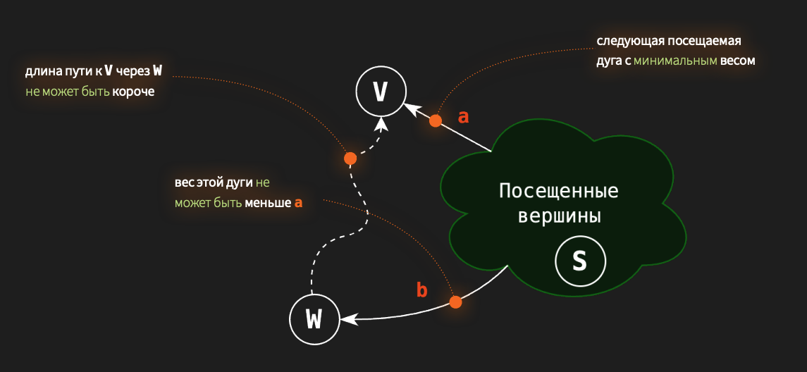

## A2. Кратчайший блиц!

### Демченко Георгий Павлович , БПИ-235

## 1. $DijkstraMULT(G, start)$

**Модифицированный алгоритм представлен в файле DijkstraMULT.cpp**

Алгоритм будет корректно искать кратчайшие пути для графов $G$ с весами ребер $\geq 1$, так как в ином случае:

- Если граф имеет ребра c весом $\in \left[0, 1\right)$, то нарушается свойство подпутей



Пусть в данном случае длинна $SV = 5$, $SW = 100$, $WV = \frac{1}{100}$, по алгоритму мы возьмем путь $SV$ как минимальный, но в действительности минимальный путь будет $SW -> WV$. По алгоритму мы получим минимальный путь от вершины $S$ до вершины $V$ равному $5$, когда в действительности минимальный равен $SW \cdot WV = 1$

- Аналогично с графом с ребрами весом $< 0$, как и стандартный Дейкстра, данный алгоритм не сможет корректно обработать такой граф.

Пусть в данном случае длинна $SV = -5$, $SW = 100$, $WV = -1$, по алгоритму мы возьмем путь $SV$ как минимальный, но в действительности минимальный путь будет $SW -> WV$. По алгоритму мы получим минимальный путь от вершины $S$ до вершины $V$ равному $-5$, когда в действительности минимальный равен $SW \cdot WV = -100$

## 2. $RestoreGraph(dist[][])$


## 3. $FloydWarshallError$


### Ошибочная реализация алгоритма Флойда-Уоршелла

```cpp
for (int32_t i = 0; i < n; ++i) {
        for (int32_t j = 0; j < n; ++j) {
            for (int32_t k = 0; k < n; ++k) {
                dist[i][j] = min(dist[i][j], dist[i][k] + dist[k][j])
            }
        }
    }
```

**Ошибка допущена в порядке выбора вершины $k$ (порядке циклов), через которую должны считаться пути между вершинами.**

Эта ошибка приводит к тому, что промежуточные вершины $k$ не обрабатываются последовательно и минимальные пути через них могут не обновится.

### Пример графа

$G = \{\{V_{0}, V_{1}, V_{2}, V_{3}, V_{5}\}, ...\}$
**Изначальная матрица дистанций $dist$:**

$$
\begin{pmatrix} 
0 & \infty & 8 & \infty & 8 \\
5 & 0 & 6 & 7 & \infty \\
\infty & \infty & 0 & \infty & 9\\
7 & \infty & 4 & 0 & 2 \\
\infty & 2 & \infty & 4 & 0
\end{pmatrix} \\
$$

### Трассировка

- i = 0 j = 0
  - k = 0 distanceMatrix[0][0] = min( distanceMatrix[0][0], distanceMatrix[0][0] + distanceMatrix[0][0]) = min(0, 0 + 0) = 0
  - k = 1 distanceMatrix[0][0] = min( distanceMatrix[0][0], distanceMatrix[0][1] + distanceMatrix[1][0]) = min(0, inf + 5) = 0
  - k = 2 distanceMatrix[0][0] = min( distanceMatrix[0][0], distanceMatrix[0][2] + distanceMatrix[2][0]) = min(0, 8 + inf) = 0
  - k = 3 distanceMatrix[0][0] = min( distanceMatrix[0][0], distanceMatrix[0][3] + distanceMatrix[3][0]) = min(0, inf + 7) = 0
  - k = 4 distanceMatrix[0][0] = min( distanceMatrix[0][0], distanceMatrix[0][4] + distanceMatrix[4][0]) = min(0, 8 + inf) = 0
- i = 0 j = 1
  - k = 0 distanceMatrix[0][1] = min( distanceMatrix[0][1], distanceMatrix[0][0] + distanceMatrix[0][1]) = min(inf, 0 + inf) = inf
  - k = 1 distanceMatrix[0][1] = min( distanceMatrix[0][1], distanceMatrix[0][1] + distanceMatrix[1][1]) = min(inf, inf + 0) = inf
  - k = 2 distanceMatrix[0][1] = min( distanceMatrix[0][1], distanceMatrix[0][2] + distanceMatrix[2][1]) = min(inf, 8 + inf) = inf
  - k = 3 distanceMatrix[0][1] = min( distanceMatrix[0][1], distanceMatrix[0][3] + distanceMatrix[3][1]) = min(inf, inf + inf) = inf
  - k = 4 distanceMatrix[0][1] = min( distanceMatrix[0][1], distanceMatrix[0][4] + distanceMatrix[4][1]) = min(inf, 8 + 2) = 10
- i = 0 j = 2
  - k = 0 distanceMatrix[0][2] = min( distanceMatrix[0][2], distanceMatrix[0][0] + distanceMatrix[0][2]) = min(8, 0 + 8) = 8
  - k = 1 distanceMatrix[0][2] = min( distanceMatrix[0][2], distanceMatrix[0][1] + distanceMatrix[1][2]) = min(8, 10 + 6) = 8
  - k = 2 distanceMatrix[0][2] = min( distanceMatrix[0][2], distanceMatrix[0][2] + distanceMatrix[2][2]) = min(8, 8 + 0) = 8
  - k = 3 distanceMatrix[0][2] = min( distanceMatrix[0][2], distanceMatrix[0][3] + distanceMatrix[3][2]) = min(8, inf + 4) = 8
  - k = 4 distanceMatrix[0][2] = min( distanceMatrix[0][2], distanceMatrix[0][4] + distanceMatrix[4][2]) = min(8, 8 + inf) = 8
- i = 0 j = 3
  - k = 0 distanceMatrix[0][3] = min( distanceMatrix[0][3], distanceMatrix[0][0] + distanceMatrix[0][3]) = min(inf, 0 + inf) = inf
  - k = 1 distanceMatrix[0][3] = min( distanceMatrix[0][3], distanceMatrix[0][1] + distanceMatrix[1][3]) = min(inf, 10 + 7) = 17
  - k = 2 distanceMatrix[0][3] = min( distanceMatrix[0][3], distanceMatrix[0][2] + distanceMatrix[2][3]) = min(17, 8 + inf) = 17
  - k = 3 distanceMatrix[0][3] = min( distanceMatrix[0][3], distanceMatrix[0][3] + distanceMatrix[3][3]) = min(17, 17 + 0) = 17
  - k = 4 distanceMatrix[0][3] = min( distanceMatrix[0][3], distanceMatrix[0][4] + distanceMatrix[4][3]) = min(17, 8 + 4) = 12
- i = 0 j = 4
  - k = 0 distanceMatrix[0][4] = min( distanceMatrix[0][4], distanceMatrix[0][0] + distanceMatrix[0][4]) = min(8, 0 + 8) = 8
  - k = 1 distanceMatrix[0][4] = min( distanceMatrix[0][4], distanceMatrix[0][1] + distanceMatrix[1][4]) = min(8, 10 + inf) = 8
  - k = 2 distanceMatrix[0][4] = min( distanceMatrix[0][4], distanceMatrix[0][2] + distanceMatrix[2][4]) = min(8, 8 + 9) = 8
  - k = 3 distanceMatrix[0][4] = min( distanceMatrix[0][4], distanceMatrix[0][3] + distanceMatrix[3][4]) = min(8, 12 + 2) = 8
  - k = 4 distanceMatrix[0][4] = min( distanceMatrix[0][4], distanceMatrix[0][4] + distanceMatrix[4][4]) = min(8, 8 + 0) = 8

- i = 1 j = 0
  - k = 0 distanceMatrix[1][0] = min( distanceMatrix[1][0], distanceMatrix[1][0] + distanceMatrix[0][0]) = min(5, 5 + 0) = 5
  - k = 1 distanceMatrix[1][0] = min( distanceMatrix[1][0], distanceMatrix[1][1] + distanceMatrix[1][0]) = min(5, 0 + 5) = 5
  - k = 2 distanceMatrix[1][0] = min( distanceMatrix[1][0], distanceMatrix[1][2] + distanceMatrix[2][0]) = min(5, 6 + inf) = 5
  - k = 3 distanceMatrix[1][0] = min( distanceMatrix[1][0], distanceMatrix[1][3] + distanceMatrix[3][0]) = min(5, 7 + 7) = 5
  - k = 4 distanceMatrix[1][0] = min( distanceMatrix[1][0], distanceMatrix[1][4] + distanceMatrix[4][0]) = min(5, inf + inf) = 5
- i = 1 j = 1
  - k = 0 distanceMatrix[1][1] = min( distanceMatrix[1][1], distanceMatrix[1][0] + distanceMatrix[0][1]) = min(0, 5 + 10) = 0
  - k = 1 distanceMatrix[1][1] = min( distanceMatrix[1][1], distanceMatrix[1][1] + distanceMatrix[1][1]) = min(0, 0 + 0) = 0
  - k = 2 distanceMatrix[1][1] = min( distanceMatrix[1][1], distanceMatrix[1][2] + distanceMatrix[2][1]) = min(0, 6 + inf) = 0
  - k = 3 distanceMatrix[1][1] = min( distanceMatrix[1][1], distanceMatrix[1][3] + distanceMatrix[3][1]) = min(0, 7 + inf) = 0
  - k = 4 distanceMatrix[1][1] = min( distanceMatrix[1][1], distanceMatrix[1][4] + distanceMatrix[4][1]) = min(0, inf + 2) = 0
- i = 1 j = 2
  - k = 0 distanceMatrix[1][2] = min( distanceMatrix[1][2], distanceMatrix[1][0] + distanceMatrix[0][2]) = min(6, 5 + 8) = 6
  - k = 1 distanceMatrix[1][2] = min( distanceMatrix[1][2], distanceMatrix[1][1] + distanceMatrix[1][2]) = min(6, 0 + 6) = 6
  - k = 2 distanceMatrix[1][2] = min( distanceMatrix[1][2], distanceMatrix[1][2] + distanceMatrix[2][2]) = min(6, 6 + 0) = 6
  - k = 3 distanceMatrix[1][2] = min( distanceMatrix[1][2], distanceMatrix[1][3] + distanceMatrix[3][2]) = min(6, 7 + 4) = 6
  - k = 4 distanceMatrix[1][2] = min( distanceMatrix[1][2], distanceMatrix[1][4] + distanceMatrix[4][2]) = min(6, inf + inf) = 6
- i = 1 j = 3
  - k = 0 distanceMatrix[1][3] = min( distanceMatrix[1][3], distanceMatrix[1][0] + distanceMatrix[0][3]) = min(7, 5 + 12) = 7
  - k = 1 distanceMatrix[1][3] = min( distanceMatrix[1][3], distanceMatrix[1][1] + distanceMatrix[1][3]) = min(7, 0 + 7) = 7
  - k = 2 distanceMatrix[1][3] = min( distanceMatrix[1][3], distanceMatrix[1][2] + distanceMatrix[2][3]) = min(7, 6 + inf) = 7
  - k = 3 distanceMatrix[1][3] = min( distanceMatrix[1][3], distanceMatrix[1][3] + distanceMatrix[3][3]) = min(7, 7 + 0) = 7
  - k = 4 distanceMatrix[1][3] = min( distanceMatrix[1][3], distanceMatrix[1][4] + distanceMatrix[4][3]) = min(7, inf + 4) = 7
- i = 1 j = 4
  - k = 0 distanceMatrix[1][4] = min( distanceMatrix[1][4], distanceMatrix[1][0] + distanceMatrix[0][4]) = min(inf, 5 + 8) = 13
  - k = 1 distanceMatrix[1][4] = min( distanceMatrix[1][4], distanceMatrix[1][1] + distanceMatrix[1][4]) = min(13, 0 + 13) = 13
  - k = 2 distanceMatrix[1][4] = min( distanceMatrix[1][4], distanceMatrix[1][2] + distanceMatrix[2][4]) = min(13, 6 + 9) = 13
  - k = 3 distanceMatrix[1][4] = min( distanceMatrix[1][4], distanceMatrix[1][3] + distanceMatrix[3][4]) = min(13, 7 + 2) = 9
  - k = 4 distanceMatrix[1][4] = min( distanceMatrix[1][4], distanceMatrix[1][4] + distanceMatrix[4][4]) = min(9, 9 + 0) = 9

- i = 2 j = 0
  - k = 0 distanceMatrix[2][0] = min( distanceMatrix[2][0], distanceMatrix[2][0] + distanceMatrix[0][0]) = min(inf, inf + 0) = inf
  - k = 1 distanceMatrix[2][0] = min( distanceMatrix[2][0], distanceMatrix[2][1] + distanceMatrix[1][0]) = min(inf, inf + 5) = inf
  - k = 2 distanceMatrix[2][0] = min( distanceMatrix[2][0], distanceMatrix[2][2] + distanceMatrix[2][0]) = min(inf, 0 + inf) = inf
  - k = 3 distanceMatrix[2][0] = min( distanceMatrix[2][0], distanceMatrix[2][3] + distanceMatrix[3][0]) = min(inf, inf + 7) = inf
  - k = 4 distanceMatrix[2][0] = min( distanceMatrix[2][0], distanceMatrix[2][4] + distanceMatrix[4][0]) = min(inf, 9 + inf) = inf

**Как мы видим dits[2][0] = inf и больше результат никогда не обновится, хотя реальный минимальный путь от $V_{2}$ до $V_{0}$ = 16**

**Фактический (неправильный) результат:**

$$
\begin{pmatrix} 
0 & 10 & 8 & 12 & 8 \\
5 & 0 & 6 & 7 & 9 \\
\infty & 11 & 0 & 13 & 9\\
7 & 4 & 4 & 0 & 2 \\
7 & 2 & 8 & 4 & 0
\end{pmatrix} \\
$$


**Корректный результат:**

$$
\begin{pmatrix} 
0 & 10 & 8 & 12 & 8 \\
5 & 0 & 6 & 7 & 9 \\
16 & 11 & 0 & 13 & 9\\
7 & 4 & 4 & 0 & 2 \\
7 & 2 & 8 & 4 & 0
\end{pmatrix} \\
$$

## 4.