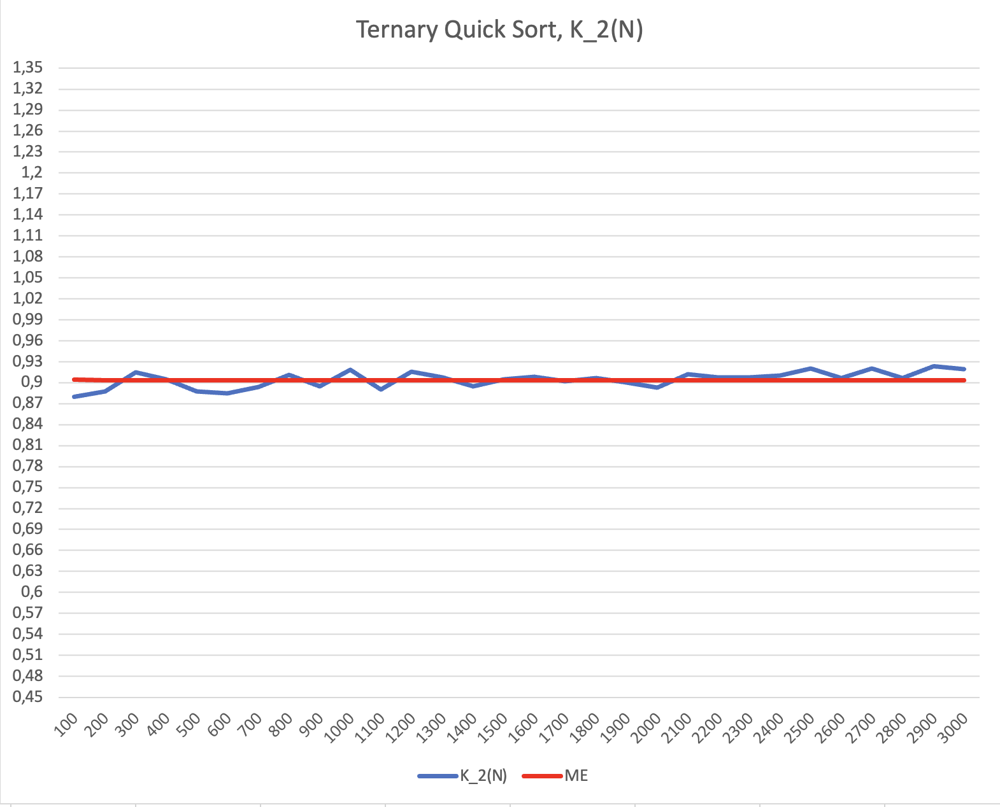
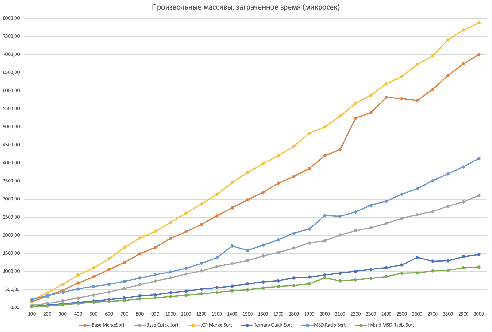

# Анализ строковых сортировок

**Демченко Георгий Павлович , БПИ-235**

## 1. Реализации адаптированных алгоритмов сортировки

| **Алгоритм** |  **CodeForces ID**  |
| ------- |  ------- |
| **LCP Merge Sort** |  *320442589* |
| **Ternary Quick Sort** | *320438960* |
| **MSD Radix Sort**  | *320526301*  |
| **Hybrid MSD Radix Sort**<br>**( MSD Radix Sort + Ternary Quick Sort )** | *320527146* |

**GitHub :** 
- [StringSorts.h](https://github.com/AvtorPaka/Alg-DS/tree/master/src/SET_9/AnalysisTasks/StringSorts.h)
- [StringSorts.cpp](https://github.com/AvtorPaka/Alg-DS/tree/master/src/SET_9/AnalysisTasks/StringSorts.cpp)


## 2. Реализация внутренней инфраструктуры для экспериментального анализа

| **Класс**  | **GitHub**  |
| ------- | ------- |
| **StringArrayGenerator**  |  [StringArrayGenerator.h](https://github.com/AvtorPaka/Alg-DS/tree/master/src/SET_9/AnalysisTasks/StringArrayGenerator.h)</br>[StringArrayGenerator.cpp](https://github.com/AvtorPaka/Alg-DS/tree/master/src/SET_9/AnalysisTasks/StringArrayGenerator.cpp)  |
| **StringSortTester**  | [StringSortTester.h](https://github.com/AvtorPaka/Alg-DS/tree/master/src/SET_9/AnalysisTasks/StringSortTester.h) </br>[StringSortTester.cpp](https://github.com/AvtorPaka/Alg-DS/tree/master/src/SET_9/AnalysisTasks/StringSortTester.cpp) |


**Пример использования:**

```cpp
StringArrayGenerator arrayGenerator;

std::string resultDataPath = "path_to_output_file.txt";
std::string testName = "Algorithm: LCP Merge Sort\nArray type: Random";

StringSortTester::SortTestParameters parameters = {
        // Sorting Function
        [](std::vector<std::string>& array, uint64_t& symbolCompareCount) {
            return StringSorts::LCPMergeSort(array, symbolCompareCount);
        },
        // Array generator function
        [&arrayGenerator](size_t size) {
            return arrayGenerator.GenerateArray(size);
        },
        testName,
        resultDataPath,
        100,        // min array size
        3000,       // max array size
        100,        // array size step
        20          // averaging rate
};

StringSortTester::Run(parameters);
```


## 3. Эмпирический анализ алгоритмов сортировки

**Исходные данные эмпирических замеров (результаты тестирования ):** [GitHub](https://github.com/AvtorPaka/Alg-DS/tree/master/src/SET_9/AnalysisTasks/test_results)


**Общие параметры тестирования:**
- Алфавит символов для формирования случайных строк в тестовых массивах (всего 74 символа):
    - A-Z
    - a-z
    - 0-9
    - !@#%:;^&*()-.

- Диапазон размеров тестовых массивов: 100-3000
- Шаг размера тестовых массивов: 100
- Диапазон длинн случайных строк в массивах: 10-200
- Количество тестов для усреднения (коэфицент усреднения): 20
- Способ усреднения: среднее арифметическое

- Количество перестановок в частично-отсортированных массивах длинны N: $\left[\frac{N}{10}\right]$
- Время работы алгоритмов посчитано в **микросекундах**
- Для каждого (среди использующих посимвольное сравнение) алгоритма посчитано количество **посимвольных сравнений строк**

**Отдельные параметры алгоритмов:**

- Способ выбора опорного элемента в реализациях *Quick Sort*: cередина рассматриваемого диапазона ( $l + \frac{r - l}{2}$ )

- Пороговое значение перехода на *Ternary Quick Sort* в *Hybrid MSD Radix Sort*: 74 (мощность используемого алфавита символов строк в массивах)

**В результатах каждого теста написаны параметры тестирования**

### 3.1 Стандартные алгоритмы сортировки

#### 3.1.1 Basic Merge Sort

|   |   |
| -------- | -------- |
|  |  |

#### 3.1.2 Basic Quick Sort

|   |   |
| -------- | -------- |
|  |   |

### 3.2 Адаптированные алгоритмы сортировки

**Подход к сравнению полученных результатов с теоретическими оценками сложности:**

- Полученные результаты времени исполнения и количества посимвольных сравнений (если такие имеются) каждого алгоритма будем сравнивать с верхней теоретической ассимптотической оценкой (O - нотация) в рамках группы тестирования "Произвольные массивы".

- Так как верхняя ассимптотическая оценка алгоритма представляет собой абстрактные единицы измерения и прямая конвертация в время исполнения может сильно варироваться в виду условий проведения и окружения тестирования, что может дать неправильную оценку при прямом сравнении, будем использовать следующий подход:

    - Для каждого алгоритма и $N$ возьмем $T(N)$ - верхную теоретическую оценку, $T_{r}(N)$ - время исполнения, $C(N)$ - количество посимвольных сравнений (только для *LCP Merge Sort*, *Ternary Quick Sort*, так как остальные алгоритмы либо вовсе не полагаются на посимвольные сравнения, либо $T(N)$ для них отличается)

    - Посчитаем $K_{1}(N) = \frac{T_{r}(N)}{T(N)}$, $K_{2}(N) =\frac{C(N)}{T(N)}$ $\forall N \in \{100, 200, \dots, 3000\}$
    - Полученные отношения $K_{1}(N), K_{2}(N)$ должны стремится к некой константе, тогда рост функций $T_{r}(N)$ и $C(N)$ отличается от $T(N)$ на эту константу и выполняется $T_{r}(N) = O(T(N))$, $C(N) = O(T(N))$
    - Если же отношения $K_{1}(N), K_{2}(N)$ не стремятся к константе, то полученные результаты не соотвествуют теоретическим оценкам сложности алгоритма

    - Так как, **согласно требованиям**, массивы для тестирования алгоритмов имеют малые размеры $\leq 3000$ строк, и выборка данных для каждого алгоритма невилика (30 значений $K_{1}(N), K_{2}(N)$, $N \in \{100, 200, \dots, 3000\}$), то достаточно весомое влияние на показатели времени исполнения алгоритма могут иметь константа и младшие члены, а показатели $K_{1}(N)$, $K_{2}(N)$ могут имет большие отклонения и не всегда явно стремится к некоторой константе.

    - Поэтому будем считать, что отношения $K_{1}(N)$, $K_{2}(N)$ стремятся к константе, если $CV(K) = \frac{\sigma_{K}}{m_{K}} \cdot 100\% \leq 10\%$, где $\sigma_{K}$ - стандартное отклонение отношения, $m_{K}$ - мат. ожидание отношения

- Так как верхняя теоретическая оценка большинства алгоритмов содержит $DP(R)$ - суммарная длинна всех различающих префиксов строк в множестве строк $R$, и её точное теоретическое значение посчитать не представляется возможным, то будем использовать известную аппроксимацию $DP(R)$  для случайного множества строк $R$
    - $DP(R) = O(N \cdot log_{|\Sigma|}(N))$, где $N$ - количество строк в множестве $R$, $|\Sigma|$ - мощность используемого алфавита символов, в нашем случае $|\Sigma| = 74$

#### 3.2.1 LCP Merge Sort

|   |   |
| -------- | -------- |
|   |   |

**Сравнение с теоретической оценкой сложности:**

$T(N) = DP(R) + N \cdot log(N) = N \cdot (log_{|\Sigma|}(N) + log(N))$

|   |   |
| -------- | -------- |
|   |   |

**$K_{1}(N)$ :**

$\sigma_{K_{1}} = 0.0177$

$m_{K_{1}} = 0.2068$

$CV_{K_{1}} = \frac{\sigma_{K_{1}}}{m_{K_{1}}} \approx 8.548\% < 10\%$ - полученные результаты **соотвествуют** теоретической оценке сложности

**$K_{2}(N)$ :**

$\sigma_{K_{2}} = 0.0103$

$m_{K_{2}} = 0.6837$

$CV_{K_{2}} = \frac{\sigma_{K_{2}}}{m_{K_{2}}} \approx 1.512\% < 10\%$ - полученные результаты **соотвествуют** теоретической оценке сложности

**Вероятные причины существенной деградации временных затрат при отличных показателях количества посимвольных сравнений:**

- Вероятнее всего, временные затраты алгоритма деградируют из-за излишнего копирования строк по-значению в временные массивы во время процесса слияния двух подмассивов и излишних алокаций памяти. Так как подобных слияния происходит $log_{2}(N)$ раз, и в каждом из них мы выделяем по 4 массива, в 2-е из которых копируем строки по-значению, то это ,скорее всего, существенно ударило по производительности.

- Была предпринята попытка оптимизировать алгоритм слияния, уменьшив общее количество копирований и алокаций, используя 2 массива вместо 4-x, и `std::move` для избежания излишний копирований строк по значению, аналогично тому, как это сделано в реализации **MSD Radix Sort**, но, к удивлению, при таком подходе временные затраты стали только хуже, и начали превышать текущую реализацию на $\approx 1$ мс в каждой категории тестов.

- В сравнительном анализе алгоритмов будем больше полагаться на количесвто посимвольных сравнений данного алгоритма и считать время исполнения несколько аномальным.

#### 3.2.2 Ternary Quick Sort

|   |   |
| -------- | -------- |
|   |   |

**Сравнение с теоретической оценкой сложности:**

$T(N) = DP(R) + N \cdot log(N) = N \cdot (log_{|\Sigma|}(N) + log(N))$

|   |   |
| -------- | -------- |
|   |   |

**$K_{1}(N)$ :**

$\sigma_{K_{1}} = 0.0359$

$m_{K_{1}} = 0.00121$

$CV_{K_{1}} = \frac{\sigma_{K_{1}}}{m_{K_{1}}} \approx 3.368\% < 10\%$ - полученные результаты **соотвествуют** теоретической оценке сложности

**$K_{2}(N)$ :**

$\sigma_{K_{2}} = 0.0116$

$m_{K_{2}} = 0.9046$

$CV_{K_{2}} = \frac{\sigma_{K_{2}}}{m_{K_{2}}} \approx 1.288\% < 10\%$ - полученные результаты **соотвествуют** теоретической оценке сложности

#### 3.2.3 MSD Radix Sort


**Алгоритм не использует посимвольное сравнение строк. Можно считать что для всех случаев количество посимвольных сравнений $=0$**

**Сравнение с теоретической оценкой сложности:**

$T(N) = DP(R) + |\Sigma| = N \cdot log_{|\Sigma|}(N) + |\Sigma|$

|   |   |
| -------- | -------- |
|   |   |

**1. $K_{1}(N)$ :**

$\sigma_{K_{1}} = 0.1419$

$m_{K_{1}} = 0.7028$

$CV_{K_{1}} = \frac{\sigma_{K_{1}}}{m_{K_{1}}} \approx 20.195\% > 10\%$ - полученные результаты **технический не соотвествуют** теоретической оценке сложности **в рамках данной выборки**

Данное несоответствие происходит из-за небольшой величины выборки (30 значений) и превалирования скрытой константы в *Counting Sort*, используемом в алгоритме, при малом размере массива, что явно можно увидеть на графике №1 ( $K_{1}(N) > 1$ при $N \in [100,300]$ и убывает с ростом $N$ ).

**Покажем, что это действительно так, увеличив и сместив выборку (график №2, [данные](https://github.com/AvtorPaka/Alg-DS/tree/master/src/SET_9/AnalysisTasks/test_results/msd_radix_sort/arr_random_2.txt))**

**2. $K_{1}(N)$ :**

$\sigma_{K_{1}} = 0.0436$

$m_{K_{1}} = 0.8322$

$CV_{K_{1}} = \frac{\sigma_{K_{1}}}{m_{K_{1}}} \approx 5.241\% < 10\%$ - полученные результаты **соотвествуют** теоретической оценке сложности


#### 3.2.4 Hybrid MSD Radix Sort

|   |   |
| -------- | -------- |
|   |   |

**Сравнение с теоретической оценкой сложности:**

$T(N) = DP(R) + N \cdot log(|\Sigma|) = N \cdot (log_{|\Sigma|}(N) + log(|\Sigma|))$


**$K_{1}(N)$ :**

$\sigma_{K_{1}} = 0.00419$

$m_{K_{1}} = 0.0422$

$CV_{K_{1}} = \frac{\sigma_{K_{1}}}{m_{K_{1}}} \approx 9.931\% < 10\%$ - полученные результаты **соотвествуют** теоретической оценке сложности

$CV_{K_{1}}$ , аналогично случаю c *MSD Radix Sort* несколько завышен из-за превалирования скрытой константы в *Counting Sort*, используемом в алгоритме, при малом размере массива, но её влияние значительно меньше из-за переключения на **Ternary Quicksort**.


## 4. Сравнительный анализ

*Так как стандартная реализация MSD Radix Sort не использует посимвольные сравнения, и можно считать их количество $= 0$ во всех категориях тестов для данного алгоритма, то будем считать, что он априоре выгодней любого другого из рассматриваемых алгоритом в данной характеристке.* 

*Далее под «Лучшим в показателе количества посимвольных сравнений» будем считать лучший (наименьшее количество сравнений) среди всех, за исключением MSD Radix Sort.*

### 4.1 Произвольные массивы

|   |   |
| -------- | -------- |
|   |  |

- Лучшие характеристики как по временным затратам, так и по количеству посимвольных сравнений показывает алгоритм **Hybrid MSD Radix Sort**. Алгоритм минимум в $\approx 2$ раза эффективней по времени затратам по сравнение с остальными алгоритмами (за исключением **Ternary Quick Sort**), как максимум в $\approx 8$ раз , и минимум в $\approx 2$ раза эффективней по количеству посимвольных сравнений, максимум в $\approx 4$ раза.

- Алгоритм **Ternary Quick Sort** имеет приближенные к лучшим показатели временных затрат, но при этом сильно деградирует по количеству посимвольных сравнений, в $\approx 2$ раза, по сравнению с **Hybrid MSD Radix Sort**.

- Худшие временные показатели имеет алгоритм **LCP Merge Sort** (вероятная причина описана в [анализе](#321-lcp-merge-sort)), при этом является вторым лучшим по количеству посимвольных сравнений, превышая характеристики **Hybrid MSD Radix Sort** в $\approx 1.5$ раза

- Алгоритм **Basic Quick Sort** имеет достаточно неплохие показатели времени исполнения, уступая только **Hybrid MSD Radix Sort** и **Ternary Quick Sort** в $\approx 2$ раза, и несколько (в $\approx 1.25$ раза) опережая **MSD Radix Sort**, при этом имея абсолютно худший показатель количества посимвольных сравнений, минимум в $\approx 1.25$ и максимум в $\approx 3.5$ раза превышая остальные алгоритмы.

- Алгоритм **Basic Merge Sort** имеет плохие показатели времени исполнения, можно считать - худшие, если принимать время исполнения **LCP Merge Sort** как аномальное, превышая показатели остальных алгоритмов минимум в $\approx 1.8$ раз, при этом также имея плохие показатели количества посимвольных сравнений, опережая лишь худший в данной категории **Basic Quick Sort** , и превышая показатели остальных алгоритмов минимум в $\approx 1.2$ раза, как максимум в $\approx 2.6$ раза.

### 4.2 Обратно-отсортированные массивы

|   |   |
| -------- | -------- |
|   |  |

- Лучшие характеристики по временным затратам показывают алгоритмы **Hybrid MSD Radix Sort** и **Ternary Quick Sort**. Алгоритмы минимум в $\approx 2,5$ раза эффективней по времени затратам по сравнение с остальными алгоритмами, как максимум в $\approx 7$ раз. **Ternary Quick Sort** при этом сильно деградирует по количеству посимвольных сравнений по сравнению с **Hybrid MSD Radix Sort** , в $\approx 2.5$ раза и является вторым худшим в данной категории тестов.

- Лучшие характеристики по количеству посимвольных сравнений показывают алгоритмы **Hybrid MSD Radix Sort** и **LCP Merge Sort**, минимум в $\approx 2,5$ раза опережаю остальные, при этом **LCP Merge Sort** начинает немного опережать **Hybrid MSD Radix Sort**  начиная с $N > 1600$ и, можно сказать, потенциально эффективный при больших N. При этом **LCP Merge Sort** имеет худшие временные показатели в данной категории (вероятная причина описана в [анализе](#321-lcp-merge-sort)).

- Алгоритм **Basic Quick Sort** имеет достаточно неплохие показатели времени исполнения, уступая только **Hybrid MSD Radix Sort** и **Ternary Quick Sort** в $\approx 2.5$ раза, и несколько (в $\approx 1.5$ раза) опережая **MSD Radix Sort**, при этом имея абсолютно худший показатель количества посимвольных сравнений, минимум в $\approx 1.4$ и максимум в $\approx 4$ раза превышая остальные алгоритмы.

- Алгоритм **Basic Merge Sort** имеет плохие показатели времени исполнения, можно считать - худшие, если принимать время исполнения **LCP Merge Sort** как аномальное, превышая показатели остальных алгоритмов минимум в $\approx 1.6$ раз, при этом имея средние показатели количества посимвольных сравнений, начиная немного (в $\approx 1.2$ раза) опережать **Ternary Quick Sort**, но существенно (в $\approx 2.5$ раза) отстает от лучших в данной категории.

### 4.3 Почти отсортированные массивы

|   |   |
| -------- | -------- |
|   |  |

- Результаты в большинстве своем идентичны результатм группы произвольных массивов.

- Лучшие характеристики как по временным затратам, так и по количеству посимвольных сравнений показывает алгоритм **Hybrid MSD Radix Sort**. Алгоритм минимум в $\approx 2.5$ раза эффективней по времени затратам по сравнение с остальными алгоритмами (за исключением **Ternary Quick Sort**), как максимум в $\approx 7.5$ раз , и минимум в $\approx 1.4$ раза эффективней по количеству посимвольных сравнений, максимум в $\approx 4$ раза.

- Алгоритм **Ternary Quick Sort** имеет приближенные к лучшим, практически идентичные, показатели временных затрат, но при этом сильно деградирует по количеству посимвольных сравнений, в $\approx 2$ раза, по сравнению с **Hybrid MSD Radix Sort**.

- Худшие временные показатели имеет алгоритм **LCP Merge Sort** (вероятная причина описана в [анализе](#321-lcp-merge-sort)), при этом является вторым лучшим по количеству посимвольных сравнений, превышая характеристики **Hybrid MSD Radix Sort** в $\approx 1.4$ раза

- Алгоритм **Basic Quick Sort** имеет достаточно неплохие показатели времени исполнения, уступая только **Hybrid MSD Radix Sort** и **Ternary Quick Sort** в $\approx 2.5$ раза, и несколько (в $\approx 1.25$ раза) опережая **MSD Radix Sort**, при этом имея абсолютно худший показатель количества посимвольных сравнений, минимум в $\approx 1.3$ и максимум в $\approx 4.4$ раза превышая остальные алгоритмы.

- Алгоритм **Basic Merge Sort** имеет плохие показатели времени исполнения, можно считать - худшие, если принимать время исполнения **LCP Merge Sort** как аномальное, превышая показатели остальных алгоритмов минимум в $\approx 1.8$ раз, при этом также имея плохие показатели количества посимвольных сравнений, опережая лишь худший в данной категории **Basic Quick Sort** , и превышая показатели остальных алгоритмов минимум в $\approx 1.3$ раза, как максимум в $\approx 3$ раза.


## 5. Вывод

- Важно учитывать характер сортируемых данных, в данном анализе показано что стандартные (не-специализированные) алгоритмы сортировки **Basic Quick Sort**, **Basic Merge Sort** не рекомендуются для строк из-за высоких временных затрат (в случае **Basic Merge Sort**) и чрезмерного количества сравнений (в случае **Basic Quick Sort**) по сравнению с большинством адаптированных алгоритмов.

- Лучшим решением для сортировки массива строк в рамках рассматриваемых алгоритмов однозначно является **Hybrid MSD Radix Sort**, являющийся лучшим или входящий в состав лучших по времени исполнения и количеству посимвольных сравнений во всех категориях тестовых данных. Однако он имеет достаточно сложную реализацию.

- Если подходить с стороны простота реализации - выгода, то со стороны времени исполнения лучше использовать **Ternary Quick Sort**, имеющего практически идентичные показатели временных затрат с **Hybrid MSD Radix Sort**, а со стороны количества посимвольных сравнений **LCP Merge Sort** или **MSD Radix Sort** (всегда 0).